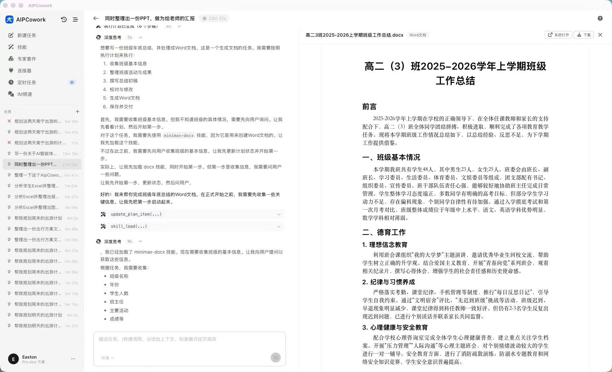
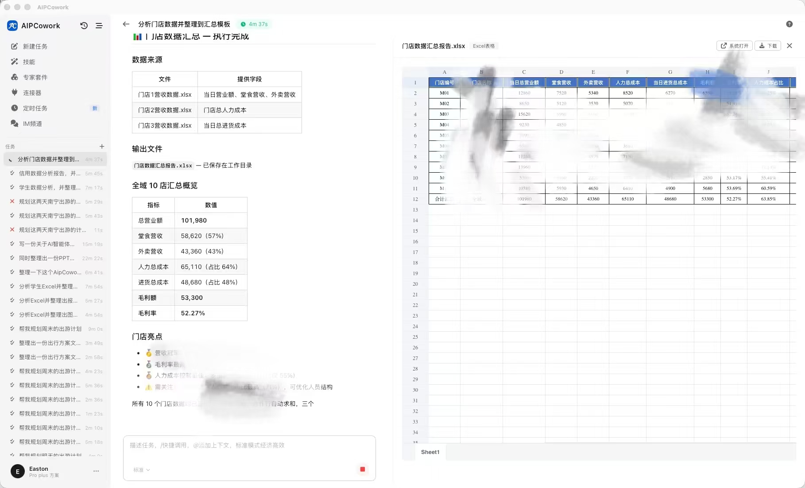
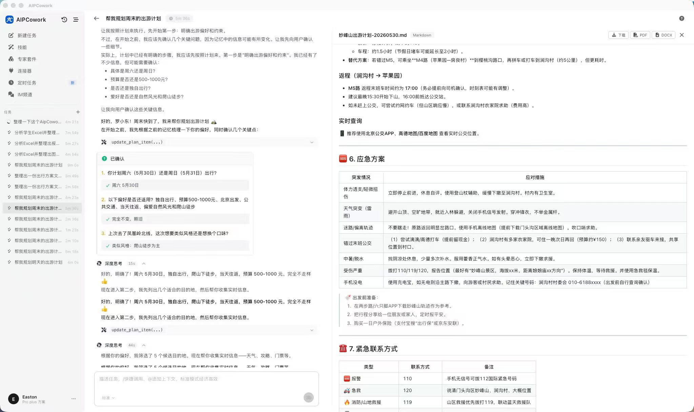
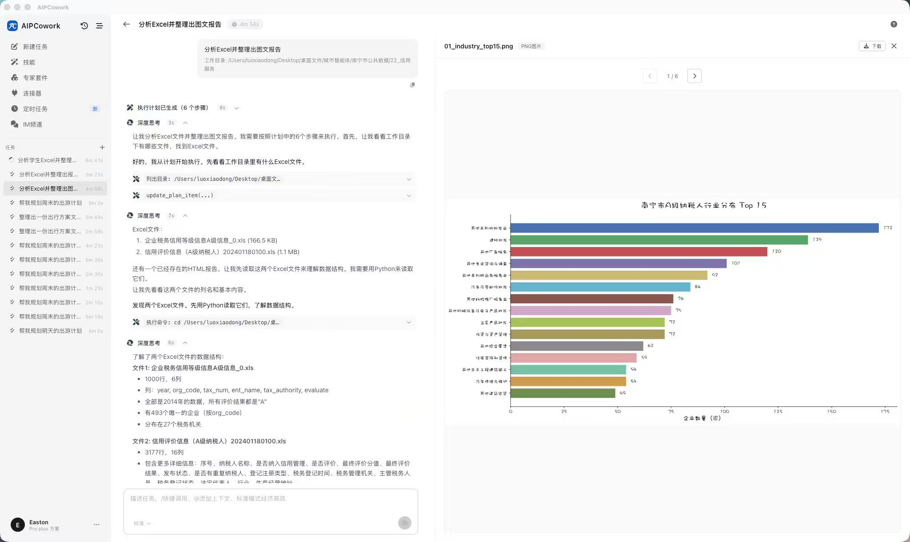
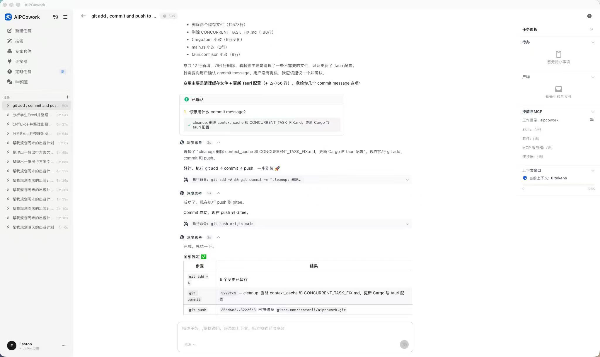
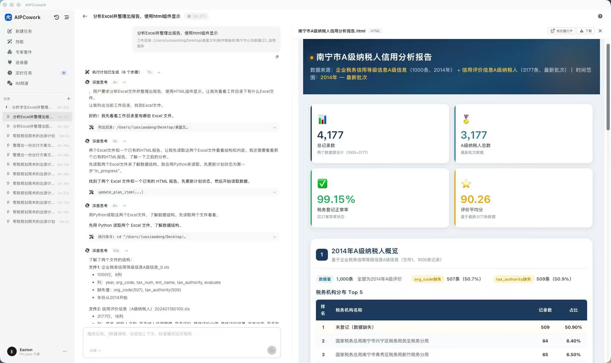
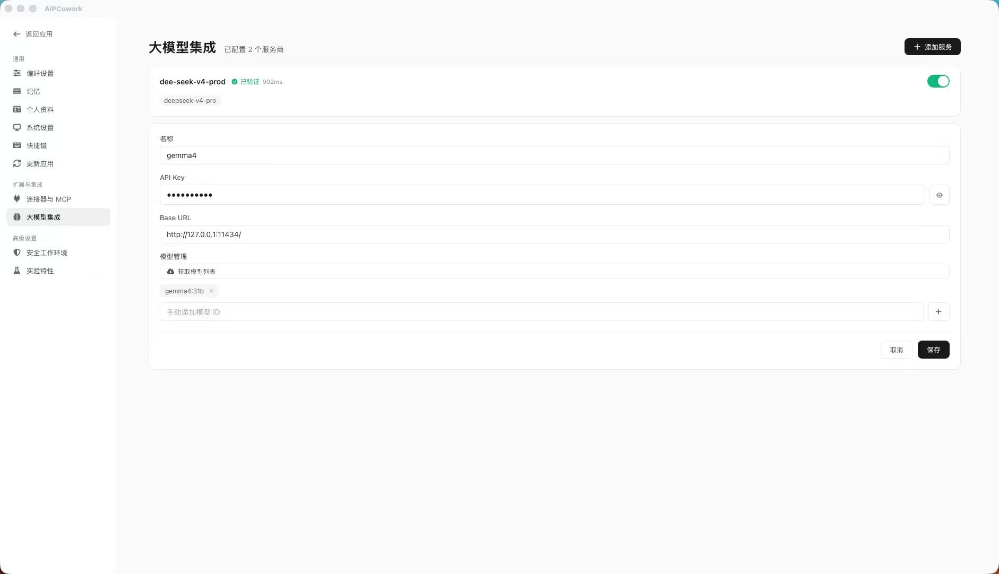

# AIPCowork

> 基于 **Tauri 2 + Vue 3 + TypeScript** 构建的桌面 AI 智能协同工作台。
> 提供完整的 Agent 任务执行、Plan-Execute 规划、ReAct 推理、技能管理、MCP 工具集成、记忆系统、子代理协作等核心能力。

仓库地址：<https://github.com/switchII/AIPCoworker.git>

---

## 产品预览

> 视频演示
 
点击查看视频演示<a href="images/demo.mp4" target="_blank">查看视频</a>

| | | |
| :---: | :---: | :---: |
|  |  |  |
|  |  |  |
|  | | |

---

## 核心代码

> **Gemma 4 原生函数调用（Native Function Calling）实现**

本项目采用 **Google Gemma 4** 作为核心推理引擎，通过 OpenAI 兼容 API 协议进行对接。Gemma 4 原生支持 Function Calling，模型可直接输出结构化的工具调用指令（tool_calls），无需中间解析层，保障调用链路的低延迟与高可靠性。

### LLM 统一客户端（[`src/agent/llm/llmClient.ts`](src/agent/llm/llmClient.ts)）

统一的 LLM 调用入口，封装了 OpenAI 兼容协议（Gemma 4 使用该协议接入）与 Anthropic 协议的差异，对外暴露一致的 `chat` / `chatRaw` / `streamChat` 接口。

**Native Function Calling 核心实现**：

```ts
// 工具定义传递给模型（OpenAI function-calling 格式，Gemma 4 原生支持）
export interface ToolDefinition {
  type: 'function'
  function: {
    name: string
    description: string
    parameters: Record<string, unknown>
  }
}

// 模型返回的工具调用（流式 + 非流式统一结构）
export interface ToolCall {
  id?: string
  index?: number
  name: string
  arguments: string
}
```

- **非流式 Function Calling**（`chatRawOpenAI`）：解析响应中的 `tool_calls` 数组，提取 `function.name` 与 `function.arguments`，返回结构化 `RawChatResponse`
- **流式 Function Calling**（`streamOpenAI`）：实时解析 SSE 流中的 `delta.tool_calls`，按 `index` 累积多工具并行调用的参数片段
- **多工具并行**：流式模式下通过 `toolCallMap`（key 为 index）聚合多个并发工具调用的增量参数，确保不丢失不混淆

### ReAct Agent 循环（[`src/agent/core/reactAgent.ts`](src/agent/core/reactAgent.ts)）

实现 Reason-Act-Observe 标准循环，是 Gemma 4 Native Function Calling 的调度中枢：

1. **构建请求**：将用户消息、对话历史、工具定义（`ToolDefinition[]`）组装为 OpenAI 兼容请求体，`tools` 参数直接注入 Gemma 4 的 function-calling 通道
2. **LLM 调用**：通过 `chatRaw()` 或 `callLLMStreaming()` 调用 Gemma 4，模型根据上下文自主决策是否发起工具调用
3. **工具执行**：解析 Gemma 4 返回的 `tool_calls` → 匹配本地工具执行器 → 获取结果 → 构造 `role: 'tool'` 消息回传模型
4. **迭代循环**：Gemma 4 收到工具结果后继续推理，可能发起新一轮工具调用或输出最终答案
5. **终止判断**：当 Gemma 4 仅返回文本（无 tool_calls）时终止循环；Plan-Execute 模式下还会检查计划完成度，未完成则强制继续（最多 5 次）

**关键代码路径**：

```
用户输入 → TaskRunner → ReAct Agent → LLM Client (Gemma 4)
    │                                    │
    │  tools: ToolDefinition[] ──────────┘  (函数定义注入)
    │                                    │
    │  ← tool_calls: ToolCall[] ─────────┘  (Gemma 4 原生输出)
    │                                    │
    │  executeTool(name, args) ─────────→│  (工具执行)
    │                                    │
    │  ← role: 'tool' message ────────→  │  (结果回传)
    │                                    │
    ↓  ← text (无 tool_calls 时) ──────  │  (最终答案)
 完成
```

### Gemma 4 配置入口（[`src/agent/llm/providerConfigs.ts`](src/agent/llm/providerConfigs.ts)）

通过统一的 Provider 配置体系接入 Gemma 4，支持 Ollama 本地部署（`http://127.0.0.1:11434`）、LM Studio、自定义 OpenAI 兼容端点三种方式。Gemma 4 作为 `openai-compatible` 格式的模型，零改造即可纳入现有工具链。

---

## 技术报告

### 模型选型：为何选择 Gemma 4

本项目选择 Gemma 4 作为核心推理引擎，核心理由聚焦以下三点：

| 维度 | 选型理由 |
| ---- | -------- |
| **内网部署** | Gemma 4 支持通过 Ollama、LM Studio 等本地推理框架在内网环境中部署运行，无需连接外部 API 服务。所有推理计算均在本地完成，数据不出内网，满足企业对数据安全的合规要求 |
| **消费级 GPU 可运行** | Gemma 4 提供多种参数规模，在消费级GPU上即可流畅运行，无需昂贵的服务器级硬件。这降低了企业部署门槛，使 AI 能力可以下沉到个人工作站 |
| **企业私有化部署，不出域** | Gemma 4 作为开源模型，支持完全私有化部署。企业可在内部服务器或个人工作站上独立运行，模型权重、推理过程、用户数据全程不离开企业内网，杜绝数据外泄风险 |

## 部署环境要求

- **Node.js** ≥ 18（推荐 LTS）
- **npm** ≥ 9 或 **yarn** ≥ 1.22 或 **pnpm** ≥ 8
- **Rust toolchain** ≥ 1.75（通过 [rustup](https://rustup.rs/) 安装）
- 平台依赖（按 OS 选择）：
    - macOS：Xcode Command Line Tools (`xcode-select --install`)
    - Windows：Microsoft Visual Studio C++ Build Tools + WebView2
    - Linux：参考 [Tauri 官方依赖列表](https://v2.tauri.app/start/prerequisites/)

确认环境：

```bash
node -v
rustc --version
cargo --version
```

## 快速开始

```bash
# 1. 克隆仓库
git clone https://github.com/switchII/AIPCoworker.git
cd aipcowork

# 2. 安装前端依赖
npm install
# 或
yarn install

# 3. 启动 Web 端（仅前端，浏览器访问 http://localhost:1420）
npm run dev

# 4. 启动桌面端（前端 + Tauri 外壳，会拉起原生窗口）
npm run tauri dev

# 5. 构建桌面安装包（产物在 src-tauri/target/release/bundle/）
npm run tauri build
```

> 首次运行 `tauri dev` / `tauri build` 需要拉取 Rust 依赖并编译，耗时较长（几分钟到十几分钟），后续会有缓存。

## 常用脚本

| 命令 | 说明 |
| ---- | ---- |
| `npm run dev` | 启动 Vite 开发服务器（仅前端） |
| `npm run build` | `vue-tsc --noEmit && vite build`，做类型检查并产出前端构建物 |
| `npm run preview` | 本地预览生产构建 |
| `npm run tauri dev` | 启动 Tauri 桌面端（带前端热更新） |
| `npm run tauri build` | 打包跨平台桌面安装包 |


### 架构设计

AIPCowork 采用 **"外壳-前端-引擎"三层解耦架构**，以 Tauri 2 为桌面外壳、Vue 3 为前端交互层、TypeScript Agent 引擎为智能核心：

```
┌─────────────────────────────────────────────────────┐
│                   Tauri 2 桌面外壳                    │
│  ┌──────────┐ ┌──────────┐ ┌────────────────────┐  │
│  │ 原生对话框 │ │ 桌面通知  │ │ 文件系统（Rust）    │  │
│  └──────────┘ └──────────┘ └────────────────────┘  │
├─────────────────────────────────────────────────────┤
│                   Vue 3 前端交互层                    │
│  ┌──────────┐ ┌──────────┐ ┌────────────────────┐  │
│  │ 任务视图  │ │ 技能管理  │ │ IM / 定时 / 设置     │  │
│  └──────────┘ └──────────┘ └────────────────────┘  │
├─────────────────────────────────────────────────────┤
│               TypeScript Agent 智能引擎              │
│  ┌──────────────────────────────────────────────┐   │
│  │               TaskRunner（任务编排）            │   │
│  │  ┌─────────┐  ┌──────────┐  ┌────────────┐  │   │
│  │  │ReAct    │  │Plan      │  │SubAgent    │  │   │
│  │  │Agent    │  │Agent     │  │Runner      │  │   │
│  │  └────┬────┘  └──────────┘  └────────────┘  │   │
│  │       │                                       │   │
│  │  ┌────▼──────────────────────────────────┐   │   │
│  │  │        LLM Client (Gemma 4)           │   │   │
│  │  │  OpenAI 兼容 / 流式+非流式 / Function Call │   │   │
│  │  └───────────────────────────────────────┘   │   │
│  │                                              │   │
│  │  ┌──────┐ ┌──────┐ ┌──────┐ ┌───────────┐  │   │
│  │  │ MCP  │ │Skill │ │Memory│ │Context     │  │   │
│  │  │Client│ │System│ │System│ │Compressor  │  │   │
│  │  └──────┘ └──────┘ └──────┘ └───────────┘  │   │
│  └──────────────────────────────────────────────┘   │
└─────────────────────────────────────────────────────┘
```

**核心设计理念**：

1. **模型无关的 LLM 抽象层**：`llmClient.ts` 通过 `ApiFormat` 区分协议（`openai-compatible` / `anthropic`），Gemma 4 以 `openai-compatible` 格式零侵入接入。新增模型只需在 `providerConfigs.ts` 中声明，无需修改 Agent 核心逻辑

2. **Function Calling 作为一等公民**：整个 Agent 引擎围绕 Native Function Calling 设计——工具定义、调用解析、结果回传均以结构化方式流转，避免基于文本解析的脆弱性

3. **Plan-Execute 双模式**：轻量任务走 ReAct 快速直行，复杂任务由 Plan Agent 先生成结构化计划再分步执行，Agent 引擎自主决策执行策略

4. **上下文与记忆分层管理**：短期记忆（对话历史裁剪 + 上下文压缩）、中期记忆（会话持久化）、长期记忆（记忆文件系统）三层体系，实现跨会话的知识延续

5. **工具生态可扩展**：MCP 协议（HTTP/SSE/stdio）支持接入外部工具服务器，技能系统遵循社区 SKILL.md 规范，子代理支持委派复杂子任务——形成以 Gemma 4 为中枢的可扩展 Agent 工具网络

---

## 目录

- [核心代码](#核心代码)
- [技术报告](#技术报告)
- [产品简介](#产品简介)
- [核心功能](#核心功能)
    - [🤖 AI Agent 智能体](#-ai-agent-智能体)
    - [📋 Plan-Execute 规划执行](#-plan-execute-规划执行)
    - [🧩 技能系统](#-技能系统)
    - [🔌 MCP 工具集成](#-mcp-工具集成)
    - [🧠 记忆与上下文](#-记忆与上下文)
    - [👥 子代理协作](#-子代理协作)
    - [📡 连接器与 IM](#-连接器与-im)
    - [⏰ 定时任务](#-定时任务)
- [技术栈](#技术栈)
- [目录结构](#目录结构)
- [环境要求](#环境要求)
- [快速开始](#快速开始)
- [常用脚本](#常用脚本)
- [路由说明](#路由说明)
- [TaskView 任务执行视图](#taskview-任务执行视图)
- [数据存储](#数据存储)
- [Tauri 桌面端](#tauri-桌面端)
- [开发约定](#开发约定)
- [常见问题](#常见问题)
- [License](#license)

---

## 产品简介

**AIPCowork** 是一个功能完整的桌面 AI 智能协同工作台，将"对话 / 规划 / 执行 / 技能 / MCP / 记忆 / 子代理 / IM / 定时任务"等能力深度融合到一个统一的桌面应用中：

- 用户在 **新建任务** 中描述任务需求，选择执行模式（ReAct 快速执行 / Plan-Execute 规划执行）
- 系统通过 **ReAct Agent** 进行推理-行动循环，或先通过 **Plan Agent** 生成执行计划再执行
- **TaskRunner** 统一管理任务生命周期，支持流式输出、实时事件、上下文压缩、问题澄清
- **技能系统** 支持内置技能、用户安装技能（Git）、AI 自创建技能，遵循社区 SKILL.md 规范
- **MCP 集成** 支持 HTTP/SSE/stdio 三种传输协议，可连接外部工具服务器
- **子代理** 可委派复杂子任务给独立 ReAgent 循环执行
- **记忆系统** 持久化会话历史、上下文文件、执行日志到本地 `~/.aipcowork/`
- 任务产物可在右侧面板实时查看，支持 HTML 预览、文件下载，并通过 IM 频道推送通知

项目已实现完整的 Agent 核心引擎、工具执行框架、前端可视化系统，可对接任意 OpenAI 兼容的 LLM 服务。

## 核心功能

### 🤖 AI Agent 智能体

**核心架构**：`ReAct Agent` + `Plan Agent` + `TaskRunner` 三层架构

- **ReAct Agent**（[`src/agent/core/reactAgent.ts`](src/agent/core/reactAgent.ts)）
    - 实现标准的 Reason-Act-Observe 循环
    - 支持流式/非流式 LLM 调用
    - 支持 DeepSeek 等模型的 reasoning_content 深度思考内容传递
    - 工具调用支持顺序执行、错误捕获、结果优化
    - 内置上下文压缩器，长对话自动压缩保持稳定性
    - 可配置最大迭代次数、历史窗口、流式回调

- **Plan Agent**（[`src/agent/core/planAgent.ts`](src/agent/core/planAgent.ts)）
    - 评估任务复杂度，判断是否需要规划
    - 生成结构化执行计划（PlanItem 列表）
    - 支持规划阶段流式输出（thinking + JSON token）
    - 计划项支持状态追踪（pending / in_progress / completed / failed）

- **TaskRunner**（[`src/agent/core/taskRunner.ts`](src/agent/core/taskRunner.ts)）
    - 统一管理任务生命周期（启动、运行、完成、终止、暂停）
    - 支持两种执行模式：`react`（快速直接） / `plan_execute`（先规划后执行）/ `auto`（自动判断）
    - 内置问题澄清机制（ask_user 工具拦截 + 多选项问答）
    - 实时事件系统：token / thinking / toolCallStart / toolCallEnd / step / complete / error
    - 自动加载技能、MCP、连接器、子代理上下文
    - 上下文优化器（大结果自动缓存到文件，避免上下文爆炸）
    - 完整的日志系统（任务日志、LLM 调用日志、工具调用日志）

### 📋 Plan-Execute 规划执行

**工作流程**：
1. **复杂度评估** → 判断任务是否需要规划
2. **计划生成** → LLM 输出 JSON 格式 PlanItem 列表
3. **计划注入** → 将计划写入系统提示，引导 Agent 按步骤执行
4. **实时追踪** → UI 侧实时显示计划项状态变化
5. **状态同步** → Agent 执行过程中通过计划工具更新状态

**计划管理工具**（[`src/agent/plan/planTools.ts`](src/agent/plan/planTools.ts)）：
- `plan_update_status` — 更新计划项状态
- `plan_add_item` — 动态添加新计划项
- `plan_remove_item` — 移除已完成的计划项

**UI 展示**：TaskView 右侧面板实时显示：
- 待办列表（带状态颜色标识）
- 当前执行中的步骤高亮
- 已完成/失败步骤统计

### 🧩 技能系统

**架构设计**：遵循社区 SKILL.md 规范（agentskills.io）

- **技能加载器**（[`src/agent/skill/skillLoader.ts`](src/agent/skill/skillLoader.ts)）
    - 扫描三个命名空间：`builtin` / `user` / `ai`
    - 解析 SKILL.md 文件的 YAML frontmatter
    - 提取元数据：name、description、version、author、license、tags、platforms、requires
    - 5 秒缓存机制，避免重复读取文件系统

- **技能管理器**（[`src/agent/skill/skillManager.ts`](src/agent/skill/skillManager.ts)）
    - 完整的 CRUD 操作：create / patch / edit / write_file / remove_file / delete
    - **Copy-on-Modify** 保护机制：AI 修改用户技能时自动复制到 ai 命名空间
    - 安全扫描：阻止危险代码模式（rm -rf、eval、exec 等）
    - 原子写入 + 备份机制，防止数据丢失
    - 草稿系统：支持技能开发中的暂存

- **技能工具**（[`src/agent/skill/skillTools.ts`](src/agent/skill/skillTools.ts)）
    - `skill_create` — 创建新技能
    - `skill_patch` — 修改技能 frontmatter
    - `skill_edit` — 编辑 SKILL.md 正文
    - `skill_write_file` — 写入技能资源文件
    - `skill_remove_file` — 删除技能资源文件
    - `skill_delete` — 删除整个技能
    - `skill_load` — 加载技能完整内容供 Agent 使用

- **Git 安装**（[`src-tauri/src/skills.rs`](src-tauri/src/skills.rs)）
    - 支持从 Git 仓库安装社区技能
    - 自动验证 SKILL.md 有效性
    - 安装到 `~/.aipcowork/skills/user/` 目录

- **UI 管理**（[`src/views/Skills.vue`](src/views/Skills.vue)）
    - 三栏分类：内置技能 / 用户安装 / AI 创建
    - 按标签分类筛选
    - 实时文件系统同步

### 🔌 MCP 工具集成

**MCP 客户端**（[`src/agent/mcp/client.ts`](src/agent/mcp/client.ts)）

- **三种传输协议**：
    - `HTTP` — 通过 fetch API 调用远程 MCP 服务器
    - `SSE` — Server-Sent Events 实时通信（自动检测 `/sse` 结尾的 URL）
    - `stdio` — 通过 Tauri 后端启动本地进程

- **认证支持**：
    - Bearer Token
    - API Key（自定义 Header）
    - Basic Auth
    - 无认证

- **连接管理**：
    - 连接池管理，避免重复连接
    - 自动初始化（initialize + notifications/initialized）
    - 连接测试（ping 健康检查）
    - 错误重试与状态追踪

- **工具发现与执行**（[`src/agent/mcp/tools.ts`](src/agent/mcp/tools.ts)）
    - 自动从 MCP 服务器发现可用工具
    - 转换为 Agent ToolDefinition 格式
    - 工具名前缀隔离（`{serverName}_{toolName}`）
    - 实时调用并转换响应格式

**支持的 MCP 服务器**：
- DashScope（通义千问）
- OpenAI
- 自定义 HTTP/SSE/stdio 服务器

### 🧠 记忆与上下文

**记忆系统**（[`src/agent/memory/`](src/agent/memory/)）

- **记忆管理**（[`memoryManager.ts`](src/agent/memory/memoryManager.ts)）
    - 持久化会话历史到 `~/.aipcowork/sessions/`
    - 管理上下文文件（任务相关的关键信息）
    - 支持记忆的增删改查

- **记忆工具**（[`memoryTools.ts`](src/agent/memory/memoryTools.ts)）
    - `memory_read` — 读取记忆文件
    - `memory_write` — 写入记忆文件
    - `memory_list` — 列出可用记忆
    - `memory_delete` — 删除过期记忆

- **会话管理**（[`src/agent/session/sessionManager.ts`](src/agent/session/sessionManager.ts)）
    - 会话生命周期管理
    - 对话历史持久化
    - 会话恢复与继续

- **上下文压缩**（[`src/agent/context/contextCompressor.ts`](src/agent/context/contextCompressor.ts)）
    - 长对话自动压缩，保持上下文在模型窗口内
    - 智能保留关键信息（工具调用、重要结论）
    - 压缩结果缓存到本地

- **上下文优化器**（[`src/agent/context/contextOptimizer.ts`](src/agent/context/contextOptimizer.ts)）
    - 大工具返回结果自动保存到文件
    - 在对话中替换为文件引用，节省 token
    - 阈值可配置（默认 8000 字符）

### 👥 子代理协作

**子代理架构**（[`src/agent/subagent/`](src/agent/subagent/)）

- **子代理运行器**（[`subAgentRunner.ts`](src/agent/subagent/subAgentRunner.ts)）
    - 独立的 ReAct Agent 循环，与主代理隔离
    - 精简工具集（文件操作 + 命令执行 + 搜索）
    - 默认最大迭代次数 15（避免子任务失控）
    - 流式 token 回传到主 UI
    - 完整的日志追踪（parentTaskId/sub_taskId）

- **子代理工具**（[`subagentTools.ts`](src/agent/subagent/subagentTools.ts)）
    - `subagent_html_generate` — 委派 HTML 生成任务
    - `subagent_code_generate` — 委派代码生成任务
    - 自动构建 SubAgentContext（LLM 配置、流式回调）
    - 结果自动返回主代理继续执行

**典型应用场景**：
- 复杂多步骤子任务（读取 → 分析 → 生成 → 写回）
- 需要工具辅助的生成任务（搜索参考后生成文档）
- 需要迭代验证的任务（生成代码 → 运行测试 → 修复错误）

### 📡 连接器与 IM

**连接器系统**

- **MCP 服务器连接**
    - 配置界面：[`src/components/settings/ConnectorsSection.vue`](src/components/settings/ConnectorsSection.vue)
    - 支持多种传输协议与认证方式
    - 实时连接测试与状态监控

- **IM 频道集成**（[`src/views/IMChannels.vue`](src/views/IMChannels.vue)）
    - 配置消息推送通道
    - 任务完成通知推送
    - 支持多种 IM 平台（待扩展）

**桌面通知**
- Tauri 原生桌面通知支持
- 任务完成时自动弹出系统通知
- 前端权限检查与用户授权

### ⏰ 定时任务

**定时任务系统**（[`src/views/ScheduledTasks.vue`](src/views/ScheduledTasks.vue)）

- 配置周期性任务（cron 表达式）
- 定点任务（指定时间执行）
- 任务模板复用
- 执行历史记录

## 技术栈

| 层级 | 选型 |
| ---- | ---- |
| 桌面外壳 | [Tauri 2.11.2](https://v2.tauri.app/) + Rust（`tauri-plugin-dialog`, `tauri-plugin-opener`, `tauri-plugin-notification`） |
| 前端框架 | [Vue 3.5](https://vuejs.org/)（`<script setup>` + Composition API） |
| 构建工具 | [Vite 6](https://vitejs.dev/) |
| 语言 | TypeScript 5.6 |
| 路由 | [Vue Router 4](https://router.vuejs.org/) |
| 状态管理 | [Pinia 3](https://pinia.vuejs.org/) |
| UI 组件库 | [Element Plus 2.11](https://element-plus.org/) + [Arco Design Vue](https://arco.design/vue) |
| 图标 | Font Awesome 7 + `@element-plus/icons-vue` |
| 校验 | `vue-tsc`（构建时类型检查） |
| YAML 解析 | `js-yaml`（前端） + `serde_yaml`（Rust 后端） |
| HTTP 请求 | Tauri `http` 插件（绕过浏览器 CORS 限制） |
| 测试框架 | `vitest` |

完整依赖见 [`package.json`](./package.json) 与 [`src-tauri/Cargo.toml`](./src-tauri/Cargo.toml)。

## 目录结构

```
aipcowork/
├── builtin-skills/             # 内置技能资源（按技能名分目录，包含 SKILL.md）
├── public/                     # Vite 静态资源
├── src/                        # 前端源码
│   ├── App.vue
│   ├── main.ts                 # 入口：注册 Pinia / Router / 全局组件
│   ├── assets/                 # 全局样式（SCSS 模块化）与图片
│   ├── components/
│   │   ├── chat/               # 聊天相关组件
│   │   ├── llm/                # LLM 配置组件
│   │   ├── settings/           # 设置页面组件
│   │   ├── task/               # 任务视图组件
│   │   ├── Layout.vue          # 全局布局（左侧导航 + 右侧主区）
│   │   ├── MarkdownRenderer.vue
│   │   └── MemoryTreeNode.vue
│   ├── agent/                  # Agent 核心模块（重点）
│   │   ├── core/               # Agent 核心循环
│   │   │   ├── reactAgent.ts   # ReAct Agent 实现
│   │   │   ├── planAgent.ts    # Plan Agent 实现
│   │   │   └── taskRunner.ts   # 任务运行器（统一管理）
│   │   ├── llm/                # LLM 客户端
│   │   │   ├── llmClient.ts    # OpenAI 兼容客户端
│   │   │   ├── providerConfigs.ts
│   │   │   └── modelFetcher.ts
│   │   ├── mcp/                # MCP 集成
│   │   │   ├── client.ts       # MCP 客户端（HTTP/SSE/stdio）
│   │   │   ├── tools.ts        # MCP 工具发现与执行
│   │   │   └── types.ts
│   │   ├── skill/              # 技能系统
│   │   │   ├── skillLoader.ts  # SKILL.md 加载器
│   │   │   ├── skillManager.ts # 技能 CRUD 管理器
│   │   │   └── skillTools.ts   # 技能管理工具定义
│   │   ├── memory/             # 记忆系统
│   │   │   ├── memoryManager.ts
│   │   │   └── memoryTools.ts
│   │   ├── session/            # 会话管理
│   │   │   └── sessionManager.ts
│   │   ├── context/            # 上下文管理
│   │   │   ├── contextCompressor.ts   # 上下文压缩
│   │   │   └── contextOptimizer.ts    # 上下文优化
│   │   ├── subagent/           # 子代理
│   │   │   ├── subAgentRunner.ts
│   │   │   └── subagentTools.ts
│   │   ├── plan/               # 计划管理
│   │   │   └── planTools.ts
│   │   ├── tools/              # 工具集
│   │   │   ├── internalTools.ts  # 内置工具
│   │   │   ├── externalTools.ts  # 外部工具（技能注入）
│   │   │   └── index.ts
│   │   ├── logger/             # 日志系统
│   │   └── notification/       # 通知系统
│   ├── services/
│   │   ├── agentLoop.ts        # Agent 循环封装
│   │   └── llmService.ts       # LLM 服务
│   ├── stores/
│   │   ├── agentStore.ts       # Pinia 主 store
│   │   └── modules/            # 模块化 store
│   ├── types/                  # TypeScript 类型定义
│   │   ├── agent.ts            # Agent 相关类型
│   │   ├── task.ts             # 任务相关类型
│   │   ├── llm.ts              # LLM 相关类型
│   │   └── integration.ts      # 集成相关类型（MCP、连接器）
│   ├── utils/                  # 工具函数
│   │   ├── workspace.ts        # 工作目录工具
│   │   └── request.ts          # HTTP 请求
│   └── views/                  # 页面级组件
│       ├── Login.vue           # 登录页
│       ├── NewTask.vue         # 新建任务
│       ├── TaskView.vue        # 任务执行视图（核心）
│       ├── AgentChat.vue       # Agent 对话
│       ├── Agent.vue           # Agent 管理
│       ├── Skills.vue          # 技能管理
│       ├── ExpertSuites.vue    # 专家套件
│       ├── ScheduledTasks.vue  # 定时任务
│       ├── IMChannels.vue      # IM 频道
│       ├── Connectors.vue      # 连接器管理
│       ├── Settings.vue        # 全局设置
│       └── ...
├── src-tauri/                  # Tauri Rust 端
│   ├── Cargo.toml
│   ├── tauri.conf.json
│   ├── build.rs
│   ├── capabilities/           # 权限声明
│   ├── icons/                  # 应用图标
│   └── src/                    # Rust 源码
│       ├── lib.rs              # 模块入口
│       ├── main.rs             # 主入口
│       ├── skills.rs           # 技能管理（Git 安装等）
│       ├── agent_tools.rs      # Agent 工具命令
│       ├── task_persistence.rs # 任务持久化
│       ├── memory_fs.rs        # 记忆文件系统
│       ├── scheduler.rs        # 调度器
│       └── common.rs           # 公共工具
├── index.html
├── package.json
├── tsconfig.json
├── vite.config.ts
└── README.md
```


## 路由说明

路由表位于 [`src/router/index.ts`](./src/router/index.ts)。所有页面默认需要登录态，未登录会被 `beforeEach` 守卫重定向到 `/login`。

| 路径 | 组件 | 用途 |
| ---- | ---- | ---- |
| `/login` | `Login.vue` | 登录入口，写入 `aipcowork_auth` localStorage |
| `/` | → `/new-task` | 默认首页跳转 |
| `/new-task` | `NewTask.vue` | 新建任务（描述需求 + 选择上下文） |
| `/task-view` | `TaskView.vue` | 任务执行可视化（详见下文） |
| `/agent-chat`、`/chat` | `AgentChat.vue` | Agent 对话视图 |
| `/agent-settings` | `AgentSettings.vue` | Agent 模型 / Prompt 配置 |
| `/skills` | `Skills.vue` | 技能管理 |
| `/expert-suites` | `ExpertSuites.vue` | 专家套件管理 |
| `/scheduled-tasks` | `ScheduledTasks.vue` | 定时任务管理（标记 `isNew`） |
| `/im-channels` | `IMChannels.vue` | IM 频道接入 |
| `/projects/new` | `ProjectNew.vue` | 新建项目 |
| `/projects/all` | `ProjectAll.vue` | 项目 / 任务总览 |
| `/settings` | `Settings.vue` | 全局设置 |

## 数据存储

AIPCowork 使用本地文件系统持久化所有重要数据，默认存储在 `~/.aipcowork/` 目录下：

```
~/.aipcowork/
├── skills/                     # 技能存储
│   ├── builtin/                # 内置技能（从应用资源同步）
│   ├── user/                   # 用户安装的技能（Git 等）
│   ├── ai/                     # AI 创建的技能
│   └── drafts/                 # 技能草稿
├── sessions/                   # 会话历史
│   └── {sessionId}.json        # 每个会话的对话历史
├── memory/                     # 记忆文件
│   └── {memoryKey}.md          # 键值对记忆文件
├── tasks/                      # 任务记录
│   └── {taskId}.json           # 任务执行日志与结果
├── logs/                       # 系统日志
│   ├── agent_{date}.log        # Agent 运行日志
│   └── llm_{date}.log          # LLM 调用日志
├── connectors.json             # 连接器配置
├── mcp-servers.json            # MCP 服务器配置
├── llm-config.json             # LLM 配置
└── settings.json               # 应用设置
```

**技能存储结构**：
```
~/.aipcowork/skills/{namespace}/{skillId}/
├── SKILL.md                    # 技能元数据（YAML frontmatter）+ 正文
├── README.md                   # 技能说明文档（可选）
├── templates/                  # 模板文件（可选）
├── resources/                  # 资源文件（可选）
└── LICENSE.txt                 # 许可证（可选）
```

**SKILL.md 格式**（遵循社区规范）：
```markdown
---
name: skill-name
description: 技能描述
version: 1.0.0
author: author-name
license: MIT
tags: [tag1, tag2]
platforms: [macos, windows, linux]
requires: [dependency-skill]
---

# 技能正文

详细的技能使用说明...
```

## TaskView 任务执行视图

`src/views/TaskView.vue` 是产品的核心页面，完整展示了一次 Agent 任务执行的可视化全过程。

### 主要区域

1. **顶部栏**：返回、任务标题、运行计时器、暂停/停止控制、问题反馈、帮助
2. **主对话区**：用户气泡 + Agent 多个执行块流式展示（深度思考、工具调用、文件生成等）
3. **底部输入区**：追问输入框 + 执行模式切换（React / Plan-Execute） + 发送
4. **右侧任务监控区**：待办计划、生成产物、工作文件、技能与 MCP、上下文窗口
5. **预览面板**：点击产物文件后从右侧滑出，支持 HTML / Markdown / 代码等多种类型实时预览

### 执行块类型

主区域中的每个执行块都遵循 **"头部点击折叠 / 展开 + 状态颜色标识 + 步骤结果可单独查看"** 的统一交互：

- **深度思考块**：Agent 当前的思路 + 关联步骤（命令、文件读取、命令执行）
- **复合多步骤思考块**：包含 **代码编辑、文件查看、网页搜索、方法执行（含失败重试）、文件生成** 等多种类型，用编号列表展示，每条带类型徽章 / 目标 / 描述 / 状态
- **代码编辑块**：暗色代码视图，展示文件名、语言、可复制
- **网页搜索块**：每条搜索结果可单独点开，查看抓取到的页面正文（HTTP 200 / 字节数 / 抓取耗时等元信息）
- **文件查询块**：列出查询到的文件名 / 大小
- **MCP 执行块**：显示方法、参数、结果，失败时高亮错误信息
- **生成文件块**：网格展示生成的产物，点击进入预览面板
- **任务完成卡片**：耗时、结果摘要、产物列表

### 状态体系

| 状态 | 颜色 | 图标 |
| ---- | ---- | ---- |
| `success` | 绿 `#10b981` | `circle-check` |
| `failed` | 红 `#ef4444` | `circle-xmark` |
| `running` | 蓝 `#3b82f6` | `spinner` 旋转 |

失败块会同时把模块整体背景轻染红色，便于在长列表中一眼定位异常。

### 折叠交互

- 每个执行块默认 **展开**，点击 header 收起
- 每个步骤行可单独点开看 **执行结果**（命令输出 / 文件内容 / 抓取正文 / JSON 返回值 / diff 等），与代码块一致的暗色面板，最高 320px 自动滚动
- 网页搜索的每个链接都可单独折叠展开其抓取内容

## Builtin Skills（内置技能）

`builtin-skills/` 目录下放置应用内置技能的资源与说明文档，每个子目录代表一个技能，必须包含：

- `SKILL.md`：技能元数据（YAML frontmatter）与详细使用指引
- 资源文件：字体（`canvas-fonts`）、模板（`templates`）、参考文档等（按需）
- 许可证：`LICENSE.txt`（部分技能资源包含独立许可证）

当前内置技能（部分）：

- `Abu-Browser`：浏览器自动化基础能力
- `algorithmic-art`：算法艺术生成
- `brand-guidelines`：品牌设计规范
- `canvas-design`：Canvas 设计（含 30+ 字体）
- `alert-sop`：告警 SOP

> Agent 在执行任务时，会通过 `skill_load` 工具动态读取对应技能的 `SKILL.md` 完整内容，并严格按照技能指令执行操作。

### 技能安装方式

1. **内置技能**：应用首次运行时自动从 `builtin-skills/` 复制到 `~/.aipcowork/skills/builtin/`
2. **Git 安装**：在 Skills 页面点击"安装"，输入 Git 仓库 URL，自动克隆到 `~/.aipcowork/skills/user/`
3. **AI 创建**：Agent 通过 `skill_create` 工具自动创建新技能，保存到 `~/.aipcowork/skills/ai/`

### 技能保护机制

- **Copy-on-Modify**：AI 修改用户技能时，自动复制到 AI 命名空间，保护原始文件
- **安全扫描**：创建/修改技能时扫描危险代码模式（`rm -rf`、`eval`、`exec` 等）
- **原子写入**：所有文件操作先写临时文件，验证后原子替换，防止数据损坏
- **备份系统**：修改前自动创建备份，支持恢复

## Tauri 桌面端

- 配置文件：[`src-tauri/tauri.conf.json`](./src-tauri/tauri.conf.json)
- Rust 源码：`src-tauri/src/`，模块化设计（lib.rs 拆分为多个独立模块）
- 已启用插件：
    - `tauri-plugin-dialog`：原生文件 / 目录选择对话框
    - `tauri-plugin-opener`：调用系统默认应用打开文件 / URL
    - `tauri-plugin-notification`：桌面通知支持
- **Rust 后端能力**：
    - 文件系统操作（读写、目录列表、技能加载）
    - Git 操作（克隆技能仓库）
    - 技能管理（CRUD、命名空间隔离、frontmatter 解析）
    - 任务持久化（JSON 序列化）
    - 记忆文件系统（类似虚拟文件系统）
    - 定时任务调度（cron 表达式解析）
    - MCP stdio 进程管理
- **权限模型**：通过 `capabilities/default.json` 声明细粒度权限
    - 文件系统访问（skills、memory、tasks 目录）
    - HTTP 请求（MCP HTTP/SSE 连接、LLM API 调用）
    - 对话框、通知、外部链接打开
- 默认窗口尺寸 / 图标 / appId 等可在 `tauri.conf.json` 中调整
- 打包产物路径：`src-tauri/target/release/bundle/`

## 开发约定

- **类型检查**：所有提交前请运行 `npm run build` 或 `npx vue-tsc --noEmit`
- **组件风格**：统一使用 `<script setup lang="ts">`
- **样式**：组件 `<style scoped>`；颜色 / 字号优先复用现有变量与既有 class
- **状态**：跨页面共享状态进 Pinia store，页面级状态用 `ref` / `reactive`
- **路由**：新增页面同时在 `router/index.ts` 注册，并在 `Layout.vue` 中按需补充导航项
- **图标**：优先 Font Awesome（`fa-solid` / `fa-regular`），保持视觉一致

## 常见问题

**Q：`npm run tauri dev` 启动很慢？**
A：首次需要编译 Rust 依赖，请耐心等待。后续会复用缓存。

**Q：Windows 端报缺少 WebView2？**
A：参考 [WebView2 Runtime](https://developer.microsoft.com/microsoft-edge/webview2/) 安装运行时。

**Q：`src-tauri/target` 体积很大（>2GB）？**
A：那是 Rust 编译产物，已被 `src-tauri/.gitignore` 忽略，不会进入版本库。如需清理：

```bash
cargo clean --manifest-path src-tauri/Cargo.toml
```

**Q：登录后想退出？**
A：清除 localStorage 里的 `aipcowork_auth`，或在浏览器 / Tauri DevTools 中执行：

```js
localStorage.removeItem('aipcowork_auth')
location.reload()
```

**Q：Ollama 集成 Gemma 4 时没有输出或没有思考过程？**
A：确保使用 Ollama ≥ 0.3.x 版本。本项目已修复 Gemma 4 模型的兼容性问题：
- Ollama Gemma 4 使用 `delta.reasoning` 字段（非 `delta.reasoning_content`），已兼容处理
- 部分 Ollama 版本即使设置 `stream: true` 也返回非流式格式，已增加 `message` 字段回退解析
- Plan Agent 在流式调用无输出时自动回退到非流式调用
- Ollama 本地模型（`http://127.0.0.1:11434`）不需要填写 API Key
- 模型列表支持从 Ollama 原生 `/api/tags` 端点获取

## License

本仓库目前未声明开源许可证；`builtin-skills/` 下部分技能资源各自包含独立 `LICENSE.txt`，使用前请遵守对应许可证条款。
