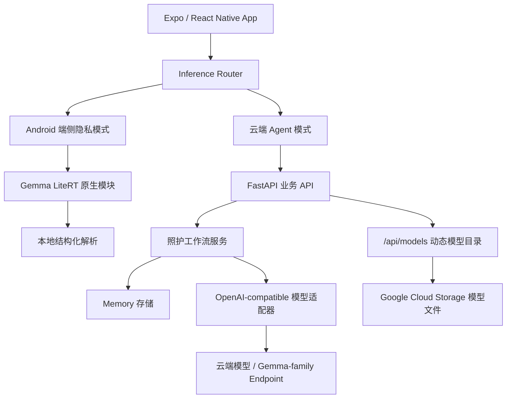

# CareMind 失智症家庭照护 Agent

## 评委速览

CareMind 是一个面向失智症家庭照护者的 Android Edge AI Care Agent。它把家属零散的照护记录整理成结构化日志、今日行动、沟通话术、照护者支持和复诊摘要，并通过端侧 Gemma LiteRT 模型让敏感记录优先留在本机处理。

为什么是 C 赛道：失智症照护里最敏感的信息常常发生在家里和深夜，包括患者状态、家庭压力、用药观察和照护者崩溃时刻。CareMind 的核心 Edge AI 价值是：这些记录不应默认全部上传云端，而应支持在 Android 设备上优先本地理解。

安全边界：CareMind 不是医疗器械，不诊断、不处方、不判断检查、不替代医生或急救服务。它只帮助家庭整理照护观察，并准备复诊沟通材料。

## 演示

**最短路径：先看视频**

<https://www.bilibili.com/video/BV1hFEg6ZEVb>

<p align="center">
  <a href="https://www.bilibili.com/video/BV1hFEg6ZEVb">
    
  </a>
</p>

**快速路径：直接测试已部署后端**

```bash
curl https://caremind-1039168666325.us-west1.run.app/health
curl https://caremind-1039168666325.us-west1.run.app/api/models
```

完整工作流示例：

```bash
curl -X POST https://caremind-1039168666325.us-west1.run.app/api/care-workflow \
  -H "Content-Type: application/json" \
  -d '{
    "patient_id": "demo_patient",
    "caregiver_id": "demo_caregiver",
    "note": "外婆夜里醒了四次，一直说有人偷钱，晚饭只吃了几口，妈妈也很累。",
    "source": "judge_demo",
    "timezone": "Asia/Shanghai"
  }'
```

预期可以看到结构化照护字段、今日关注事项、照护沟通建议和非诊断性下一步提示。

**完整路径：Android 端侧 AI 演示**

```text
Android App -> 设置 / 隐私模式 -> 刷新模型目录 -> 下载 Gemma LiteRT 模型
-> 关闭网络 -> 输入敏感照护记录 -> 本机生成非诊断性照护理解与建议
```

完整产品仓库：<https://github.com/hyczy0809/CareMind>

## 为什么做 CareMind

失智症家庭照护的难点不是只发生在诊室里。家属每天要记住夜间起床、拒药、少食、怀疑东西被偷、反复要回家、情绪激动和自己的疲惫。复诊时，医生需要的是清楚的近期变化，但家属常常只能依靠记忆和碎片聊天记录。

CareMind 的目标不是替医生判断病情，而是帮助家属把这些混乱日常变成可记录、可追踪、可沟通的照护线索。

## CareMind 做什么

| 照护负担 | CareMind 输出 |
|---|---|
| 说不清今天发生了什么 | 结构化照护日志 |
| 不知道今晚先做什么 | 今日关注事项 + 低负担行动 |
| 和患者沟通冲突 | 低冲突沟通话术 |
| 复诊时回忆不清 | 近 7 天 / 30 天复诊摘要 |
| 记录太私密 | Android 端侧隐私模式 |
| 照护者快撑不住 | 压力识别 + 支援提醒 |

产品闭环：

```text
零散照护记录
-> 结构化照护日志
-> 今日行动
-> 沟通话术
-> 照护者支持
-> 复诊摘要
-> 隐私优先的端侧处理
```

核心页面：

- **今日照护**：展示今天值得留意的事、行动三态、陪伴活动和照护者支持。
- **智能记录**：输入或语音记录照护事件，生成结构化日志、家庭观察信号和沟通话术。
- **复诊准备**：聚合近 7 天 / 30 天记录、病历/检查/用药资料，生成可复制复诊摘要。

## 为什么是 Edge AI

CareMind 选择 C 赛道不是因为“端侧更酷”，而是因为产品场景本身需要隐私优先。

Edge AI 证据：

- Android 真机路径：`source/frontend/android/app/src/main/java/com/caremind/app/gemma`
- 端侧模型：Gemma-family LiteRT `.litertlm` / `.task`
- 当前演示默认模型：`Gemma3-1B-IT_multi-prefill-seq_q4_ekv4096.litertlm`
- 推理桥接：Android Kotlin native module + `source/frontend/lib/inference/local`
- 模型目录：App 调用 `GET /api/models`，Cloud Run 动态扫描 Google Cloud Storage
- 隐私路由：`source/frontend/lib/inference/inference-router.ts` 根据模式选择本地或云端
- 离线演示：下载模型后可关闭 Wi-Fi / 移动网络，演示本地照护理解

### 模型使用说明

| 场景 | 模型 / 路径 | 状态 | 作用 |
|---|---|---|---|
| Android 端侧隐私模式 | Gemma 3 1B LiteRT `.litertlm` | 可演示 | 敏感照护记录本地理解与建议生成 |
| Android 端侧更大候选 | Gemma 4 E2B / E4B LiteRT | 已支持路径 / 实验性 | 通过动态模型目录支持，真机稳定性取决于设备内存 |
| 云端 Agent 工作流 | OpenAI-compatible / Gemma-family endpoint | 已完成 | 完整工作流、摘要、工具调用 |
| 稳定性兜底 | deterministic parser / fallback builders | 已完成 | 保证 Demo 不因小模型输出不完整而中断 |

不要混淆：当前真机端侧演示默认使用 Gemma 3 1B LiteRT；Gemma 4 E2B/E4B 是已预留动态目录支持的更大候选模型，不作为普通手机上的默认稳定模型承诺。

## 架构设计



核心接口：

```http
POST /api/care-workflow
POST /api/reports/follow-up
POST /api/guardrail/check
GET  /api/models
GET  /api/models/{filename}
POST /v1/chat/completions
```

## 当前完成度

| 能力 | 状态 |
|---|---|
| Cloud Run 后端 | 已完成 |
| `/api/care-workflow` | 已完成 |
| `/api/reports/follow-up` | 已完成 |
| `/api/models` 动态模型目录 | 已完成 |
| Android 原生 Gemma bridge | 可演示 |
| Gemma 3 1B LiteRT Android 隐私模式 | 可演示 |
| Gemma 4 E2B/E4B Android 模型路径 | 已支持路径 / 实验性 |
| 完全离线 Android 推理 | 可演示 / 实验性 |
| 云端 Agent Tool Calling | 已完成 |
| 医生协作端 | 未来计划 |
| 临床验证 | 不在本次范围 |

## 运行方式

### 推荐评委验证路径

1. 先看演示视频。
2. 用上面的示例请求测试已部署后端。
3. 查看 Android Edge AI 相关代码路径。
4. 阅读技术报告和安全边界。

### 本地后端

```bash
cd source/backend
python3 -m venv .venv
source .venv/bin/activate
pip install -r requirements.txt
cp .env.example .env
uvicorn main:app --host 127.0.0.1 --port 8090
```

冒烟测试：

```bash
curl http://127.0.0.1:8090/health
curl http://127.0.0.1:8090/api/models
```

### Docker 后端

```bash
cd source/backend
cp .env.example .env
docker build -t caremind-backend .
docker run --rm \
  --env-file .env \
  -e PORT=8080 \
  -p 8080:8080 \
  caremind-backend
```

### Android 端侧 AI 演示

完整 Android 工程见主项目仓库。本提交目录保留与 C 赛道评审相关的关键 Native 和 TypeScript 端侧模块。

Android 编译环境：

- Expo SDK 52
- React Native 0.76
- Android compileSdk 35
- Android minSdk 24
- 推荐 JDK 17
- MediaPipe GenAI runtime：`com.google.mediapipe:tasks-genai:0.10.35`

构建示例：

```bash
cd frontend
npm install
npm run typecheck
cd android
NODE_ENV=production \
EXPO_PUBLIC_CAREMIND_API_URL=https://caremind-1039168666325.us-west1.run.app \
./gradlew :app:assembleRelease
```

硬件演示步骤：

1. 在 Android 手机上安装 CareMind APK。
2. 打开 **设置 / 隐私模式**。
3. 刷新模型目录。
4. 从后端下载 LiteRT 模型。
5. 关闭 Wi-Fi 和移动网络。
6. 输入一条敏感照护记录。
7. 展示 CareMind 在本地返回非诊断性照护观察和低负担行动建议。

## 技术亮点

1. **Android 端侧隐私模式**
   代码：[source/frontend/android/app/src/main/java/com/caremind/app/gemma](source/frontend/android/app/src/main/java/com/caremind/app/gemma)

2. **本地 / 云端推理路由**
   代码：[source/frontend/lib/inference/inference-router.ts](source/frontend/lib/inference/inference-router.ts)

3. **动态模型目录**
   代码：[source/frontend/lib/inference/local/model-catalog.ts](source/frontend/lib/inference/local/model-catalog.ts), [source/backend/main.py](source/backend/main.py)

4. **云端 Agent Tool Calling**
   代码：[source/backend/my_agent/cloud_agents.py](source/backend/my_agent/cloud_agents.py), [source/backend/my_agent/cloudflare_openai_model.py](source/backend/my_agent/cloudflare_openai_model.py)

5. **结构化产品数据，而不是纯聊天输出**
   代码：[source/frontend/lib/inference/local/xml-parsers.ts](source/frontend/lib/inference/local/xml-parsers.ts), [source/backend/my_agent/care_workflow_service.py](source/backend/my_agent/care_workflow_service.py)

## 安全与隐私边界

- CareMind 不是医疗器械。
- 不诊断失智症进展。
- 不处方，不建议开始、停止、加减或更换药物。
- 不判断是否需要 MRI、CT、PET、血液检查或认知量表。
- 不替代医生、急救服务或线下专业支持。
- 病历、检查、用药资料进入复诊摘要前，需要家属确认。
- 涉及走失、自伤、伤人、急性意识改变、严重受伤等场景时，应联系当地紧急服务或医生。
- 仓库只包含脱敏演示数据，不包含真实患者、家庭、医院、账号或生产系统数据。
- 大模型文件应通过 Google Cloud Storage 或 Git LFS 管理，不应作为普通 Git blob 提交。

## 交付物

| 交付物 | 位置 |
|---|---|
| 主项目仓库 | <https://github.com/hyczy0809/CareMind> |
| 比赛 PR | <https://github.com/gdgshanghai/Gemma4-Hackathon-ShangHai/pull/57> |
| 演示视频 | <https://www.bilibili.com/video/BV1hFEg6ZEVb> |
| Cloud Run 后端 | <https://caremind-1039168666325.us-west1.run.app> |
| 技术报告 | [TECHNICAL_REPORT.md](TECHNICAL_REPORT.md) |
| 硬件演示说明 | [EDGE_HARDWARE_DEMO.md](EDGE_HARDWARE_DEMO.md) |
| Demo 分镜 | [docs/demo_storyboard.md](docs/demo_storyboard.md) |
| 录制指南 | [docs/recording_guide.md](docs/recording_guide.md) |
| 后端入口 | [source/backend/main.py](source/backend/main.py) |
| OpenAI-compatible Agent 路由 | [source/backend/openai_compat.py](source/backend/openai_compat.py) |
| Agent / Memory 工作流 | [source/backend/my_agent](source/backend/my_agent) |
| Android Gemma bridge | [source/frontend/android/app/src/main/java/com/caremind/app/gemma](source/frontend/android/app/src/main/java/com/caremind/app/gemma) |
| 本地 / 云端推理路由 | [source/frontend/lib/inference](source/frontend/lib/inference) |

## 目录结构

```text
CareMind/
├── README.md
├── TECHNICAL_REPORT.md
├── EDGE_HARDWARE_DEMO.md
├── requirements.txt
├── docs/
│   ├── caremind-demo-video-preview.png
│   ├── demo_storyboard.md
│   └── recording_guide.md
└── source/
    ├── backend/
    │   ├── main.py
    │   ├── openai_compat.py
    │   ├── my_agent/
    │   ├── requirements.txt
    │   ├── Dockerfile
    │   └── .env.example
    └── frontend/
        ├── app.json
        ├── package.json
        ├── lib/inference/
        ├── lib/speech/android-speech.ts
        └── android/
```

## 为什么选择 C 赛道

CareMind 的核心洞察不是“AI 可以总结文本”，而是：**最敏感的照护时刻往往发生在家里、深夜、照护者自己的手机上**。因此 Edge AI 是产品需求，而不是装饰性技术点。CareMind 希望让家属在不把每一段原始私密记录都交给云端的情况下，也能获得结构化照护理解和下一步支持。
