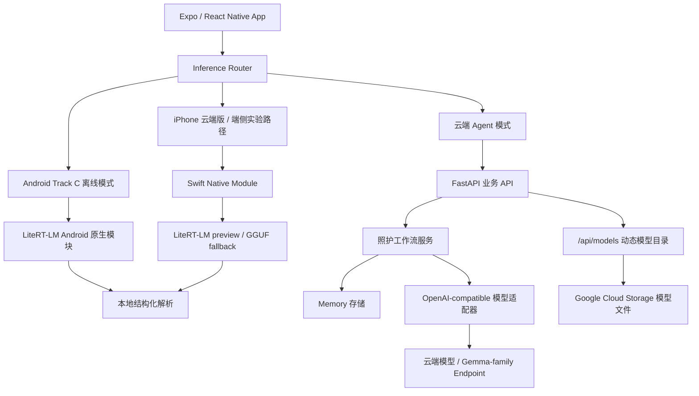

# CareMind 失智症家庭照护 Agent

## 1. 项目名称

正式项目名称：**CareMind 失智症家庭照护 Agent**

参赛赛道：**赛道 C · Edge AI**

项目定位：面向失智症家庭照护者的 AI Care Agent，把家属零散的照护记录整理成结构化日志、今日关注事项、沟通话术、照护者支持和复诊摘要。

当前运行形态：

| 运行形态 | 当前状态 | 验证重点 |
|---|---|---|
| Android Track C 离线模式 | 已接入 Gemma 4 E2B `.litertlm` + LiteRT-LM Android；E4B 走同一 readiness contract | 飞行模式、本地 smoke test、`native_litertlm_success` provenance |
| iPhone 云端 Agent 版 | 已支持完整 App 与云端 Agent 工作流 | 智能记录、今日照护、资料上传和复诊准备 |
| iPhone 端侧实验路径 | 已保留 Swift Native Bridge，可用于 LiteRT-LM preview / GGUF fallback 验证 | 本地模型生命周期、端侧解析和真机性能继续压测 |
| 云端 Agent 后端 | 已部署到 Google Cloud Run | 照护工作流、复诊摘要、资料上传和模型目录 |

> **安全边界**
> CareMind 不是医疗器械，不诊断、不处方、不判断检查、不替代医生或急救服务。它只帮助家庭整理照护观察，并准备复诊沟通材料。

## 2. 项目简介

失智症家庭照护的压力大多发生在医院之外。家属需要记住夜间起床、拒药、少食、怀疑东西被偷、反复要回家、情绪激动和自己的疲惫。复诊时，医生需要的是清楚的近期变化，但家属常常只能依靠记忆和零散聊天记录。

CareMind 做的是一条家庭照护闭环：

| 家属遇到的问题 | CareMind 的输出 |
|---|---|
| 零散记录说不清 | 结构化照护日志 |
| 不知道今天先做什么 | 今日关注事项和低负担行动 |
| 沟通容易起冲突 | 低冲突沟通话术 |
| 复诊前信息混乱 | 近 7 天 / 30 天复诊摘要 |
| 照护者压力过高 | 照护者支持和求助提醒 |
| 记录过于私密 | Android / iPhone 端侧隐私模式 |

核心页面：

| 页面 | 主要内容 |
|---|---|
| 今日照护 | 今天值得留意的事、行动三态、陪伴活动和照护者支持 |
| 智能记录 | 输入或语音记录照护事件，生成结构化日志、家庭观察信号和沟通话术 |
| 复诊准备 | 聚合近 7 天 / 30 天记录、病历/检查/用药资料，生成可复制复诊摘要 |
| 隐私模式 / Track C 离线验证 | 下载或导入 Gemma 4 本地模型，完成 validation、runtime init、smoke test 后再运行离线工作流 |

CareMind 的重点不是“AI 总结文本”，而是让照护者在混乱和疲惫时，知道今天先做什么、复诊该说什么，也知道哪些信息应该先留在自己手机里。

## 3. 在线演示链接

演示视频：

<https://www.bilibili.com/video/BV1hFEg6ZEVb>

<p align="center">
  <a href="https://www.bilibili.com/video/BV1hFEg6ZEVb">
    
  </a>
</p>

演示入口：

| 入口 | 适合查看 | 重点 |
|---|---|---|
| 演示视频 | 快速了解产品故事和完整闭环 | 从家庭照护记录到今日行动、沟通话术、复诊准备 |
| Android Track C 端侧演示 | 验证 C 赛道 Edge AI 能力 | Gemma 4 E2B/E4B + LiteRT-LM 本机推理，rule fallback 不能冒充成功 |
| iPhone 端侧演示 | 验证 iOS 隐私模式实验路径 | Swift Native Bridge、本地模型生命周期和端侧解析 |
| iPhone 云端版 | 验证完整 App 体验 | 智能记录、今日照护、复诊准备、资料上传和录音转写 |

Android 端侧路径：

```text
Android App
-> 设置 / 隐私模式
-> 刷新模型目录
-> 下载或导入 Gemma 4 E2B .litertlm 模型
-> 运行本地 Gemma smoke test
-> 开启飞行模式或关闭 Wi-Fi / 移动网络
-> 运行 Track C 离线验证
-> 输入敏感照护记录
-> 结果必须显示 source=native_litertlm_success、nativeGenerateReturned=true、rawOutputHash=...
```

iPhone 云端版路径：

```text
iPhone / iOS Simulator
-> 已部署云端服务
-> 智能记录、今日照护、复诊准备、资料上传、录音上传转写
```

iPhone 端侧路径：

```text
iPhone App
-> 设置 / 隐私模式
-> 下载或导入本地模型
-> 输入敏感照护记录
-> Swift Native Bridge 验证本地模型生命周期和端侧解析
```

当前比赛主验收路径以 Android 真机 Track C 离线模式为准。iPhone 端侧路径保留为跨平台工程验证，不把未完成真机压测的结果写成本次 Track C 主成绩。

## 4. 项目仓库链接

主项目仓库：

<https://github.com/hyczy0809/CareMind>

比赛 fork 提交目录：

<https://github.com/whitesungun876/Gemma4-Hackathon-ShangHai/tree/main/submissions/2026/track_C/CareMind>

官方 PR：

<https://github.com/gdgshanghai/Gemma4-Hackathon-ShangHai/pull/64>

## 5. 运行方式

### 方式一：本地后端

```bash
cd source/backend
python3 -m venv .venv
source .venv/bin/activate
pip install -r requirements.txt
cp .env.example .env
uvicorn main:app --host 127.0.0.1 --port 8090
```

冒烟测试：

```bash
curl http://127.0.0.1:8090/health
curl http://127.0.0.1:8090/api/models
```

### 方式二：Docker 后端

```bash
cd source/backend
cp .env.example .env
docker build -t caremind-backend .
docker run --rm \
  --env-file .env \
  -e PORT=8080 \
  -p 8080:8080 \
  caremind-backend
```

### 方式三：本地 Web 前端

```bash
cd source/frontend
npm install
EXPO_PUBLIC_CAREMIND_API_URL=https://caremind-1039168666325.us-west1.run.app npm run web -- --port 8082
```

浏览器打开：

```text
http://127.0.0.1:8082
```

### 方式四：iPhone / iOS 云端版

```bash
cd source/frontend
npm install
EXPO_PUBLIC_CAREMIND_API_URL=https://caremind-1039168666325.us-west1.run.app npm run ios:cloud
```

EAS 内部分发：

```bash
cd source/frontend
npm install -g eas-cli
eas login
eas build -p ios --profile preview
```

### 方式五：Android 端侧 AI 演示

Android 编译环境：

- Expo SDK 52
- React Native 0.76
- Android compileSdk 35
- Android minSdk 24
- 推荐 JDK 17
- LiteRT-LM Android runtime：`com.google.ai.edge.litertlm:litertlm-android:0.13.1`

构建示例：

```bash
cd source/frontend
npm install
npm run typecheck
cd android
NODE_ENV=production \
EXPO_PUBLIC_CAREMIND_API_URL=https://caremind-1039168666325.us-west1.run.app \
./gradlew :app:assembleRelease
```

硬件演示步骤：

1. 在 Android 手机上安装 CareMind APK。
2. 打开 **设置 / 隐私模式**。
3. 刷新模型目录。
4. 下载或导入 Gemma 4 E2B `.litertlm` 模型。
5. 运行 **本地 Gemma smoke test**，确认 native output hash 存在。
6. 开启飞行模式或关闭 Wi-Fi / 移动网络。
7. 运行 **Track C 离线验证**。
8. 输入一条敏感照护记录。
9. 展示 `source=native_litertlm_success`、`nativeGenerateReturned=true`、`rawOutputHash=...`。

Track C 本地模型要求：

- APK / AAB 不内置模型权重。
- Release 包通过 Cloud Run 模型目录获取下载信息；Debug 构建可优先导入 `/data/local/tmp/llm/gemma.litertlm`。
- 模型只有在文件存在、可读、大小/扩展名/哈希校验通过、LiteRT-LM runtime 初始化成功、本地 smoke test 返回非空 native output 后，状态才会变成 `ready`。
- 如果结果是 `rule_local_fallback`、`manual_draft` 或 `unavailable`，只能说明本地安全兜底工作正常，不能作为 Gemma 4 本地推理成功证据。

## 6. 技术栈

| 层级 | 技术选择 |
|---|---|
| 前端 | Expo SDK 52, React Native 0.76, Expo Router, TypeScript |
| 前端 UI | React Native Components, lucide-react-native, expo-blur, expo-haptics, expo-linear-gradient |
| Android 端侧 | Kotlin Native Module, LiteRT-LM Android `com.google.ai.edge.litertlm:litertlm-android:0.13.1`, Gemma 4 `.litertlm` |
| iOS 端侧 | Expo Swift Native Module, iOS Model Store, LiteRT-LM preview / llama.cpp GGUF fallback, CPU / Accelerate runtime |
| 后端 | FastAPI, Uvicorn, Python 3.12 |
| Agent | Google ADK Agent, OpenAI-compatible model adapter, Cloudflare AI Gateway |
| Memory | JSON-backed Memory Store, Memory Router, Memory Policy, Memory Tools |
| 模型分发 | Google Cloud Storage 动态模型目录, `/api/models`, signed URL / direct download, app-private model storage |
| 部署 | Google Cloud Run, Docker |

## 7. Agent 与系统架构

### 7.1 总体架构



### 7.2 Agent 架构

CareMind 云端采用 **1 个 Root Orchestrator + 5 个 Specialist Agents**。Memory Router、Memory Update、Knowledge Retrieval 和 Guardrail 是工作流模块，不单独算成对话 Agent。

| Agent | 数量 | 职责 | 代码 |
|---|---:|---|---|
| `caremind_cloud_root_agent` | 1 | 总调度器，判断任务、编排子 Agent、统一输出非诊断性照护建议 | `source/backend/my_agent/cloud_agents.py` |
| `event_structuring_agent` | 1 | 把自然语言照护记录抽取成结构化事件，并写入 Episodic Memory | `source/backend/my_agent/cloud_agents.py` |
| `patient_risk_agent` | 1 | 结合近期事件、行为基线和安全规则生成非诊断性今日关注提示 | `source/backend/my_agent/cloud_agents.py` |
| `caregiver_support_agent` | 1 | 识别照护者睡眠不足、压力和耗竭线索，生成支持建议 | `source/backend/my_agent/cloud_agents.py` |
| `care_plan_agent` | 1 | 把关注卡片、患者偏好、历史有效方法和知识库转成低负担行动计划 | `source/backend/my_agent/cloud_agents.py` |
| `doctor_summary_agent` | 1 | 调用长期 Memory 生成近 7 天 / 30 天复诊摘要和问题清单 | `source/backend/my_agent/cloud_agents.py` |

显式 ADK Agent 一共 **6 个**。

云端工作流：

```text
用户记录
-> Root Orchestrator
-> Event Structuring Agent
-> Memory Router / Knowledge Retrieval
-> Patient Risk Agent
-> Caregiver Support Agent
-> Care Plan Agent
-> Memory Update / Guardrail
-> Doctor Summary Agent
-> 前端结构化展示
```

核心接口：

```http
POST /api/care-workflow
POST /api/reports/follow-up
POST /api/guardrail/check
GET  /api/models
GET  /api/models/{filename}
POST /v1/chat/completions
```

### 7.3 Track C 端侧模型与验证

| 场景 | 模型 / 路径 | 状态 | 作用 |
|---|---|---|---|
| Track C Android 主验收路径 | Gemma 4 E2B `.litertlm` + LiteRT-LM Android | 已接入，readiness-gated | 智能记录、简单话术、危机/医疗边界、本地短复诊摘要 |
| Track C 更大候选 | Gemma 4 E4B `.litertlm` + 同一 runtime contract | 路由与校验路径已预留 | 适合更高内存设备继续压测 |
| 本地规则安全兜底 | deterministic guardrail / parser / fallback builders | 已完成 | 模型未就绪、JSON 解析失败、医疗越界或危机表达时保证安全，但不计为 native Gemma 成功 |
| iPhone / iOS 云端版 | Cloud Run Agent workflow | 已支持 | 完整 App 体验、资料上传、录音上传转写 |
| iPhone / iOS 端侧实验路径 | Swift Native Module + LiteRT-LM preview / GGUF fallback | 已保留 / 继续性能压测 | 跨平台模型生命周期、端侧解析和本地推理入口验证 |
| 云端 Agent 工作流 | OpenAI-compatible / Gemma-family endpoint | 已完成 | 非 Track C judged path，用于完整产品和 hybrid 模式 |

Track C 离线验证必须同时满足：

- 飞行模式或网络关闭状态下运行。
- 选中的模型状态为 `ready`，且 smoke test 通过。
- `nativeGenerateAttempted=true`、`nativeGenerateReturned=true`、`rawOutputLength > 0`、`rawOutputHash` 存在。
- 普通智能记录结果为 `source=native_litertlm_success`，或 native 有输出但结构化解析失败时明确标成 `native_litertlm_parse_fallback`。
- 如果普通任务只得到 `rule_local_fallback`，离线验证必须失败，并提示“本地 Gemma 模型没有运行”。

## 8. 项目亮点

| 亮点 | 说明 |
|---|---|
| 失智症家庭照护专用 Agent | 围绕照护日志、今日关注、沟通话术、复诊摘要和照护者压力支持组织输出 |
| Edge AI 来自真实隐私需求 | Track C 主链路在 Android 真机飞行模式下运行 Gemma 4，本地结果带 provenance 和 raw output hash |
| 云端多 Agent + Memory 工作流 | 6 个显式 ADK Agent 负责事件结构化、非诊断性关注提示、照护者支持、行动计划和复诊摘要 |
| 完整前端 UI 已提交 | `source/frontend/app` 和 `source/frontend/components` 包含今日照护、智能记录、复诊准备、设置页、资料上传和隐私模式 UI |
| Android 与 iPhone 路线都保留 | Android 用于 C 赛道端侧硬件演示；iPhone 端保留 Swift Native Bridge 作为跨平台端侧实验路径 |
| 医疗边界前置 | 不诊断、不处方、不判断检查；复诊摘要和资料进入报告前需要家属确认 |

## 9. 交付物说明

| 交付物 | 位置 |
|---|---|
| 主项目仓库 | <https://github.com/hyczy0809/CareMind> |
| 比赛 fork 提交目录 | <https://github.com/whitesungun876/Gemma4-Hackathon-ShangHai/tree/main/submissions/2026/track_C/CareMind> |
| 官方 PR | <https://github.com/gdgshanghai/Gemma4-Hackathon-ShangHai/pull/64> |
| 演示视频 | <https://www.bilibili.com/video/BV1hFEg6ZEVb> |
| 技术报告 | `TECHNICAL_REPORT.md` |
| 硬件演示说明 | `EDGE_HARDWARE_DEMO.md` |
| Demo 分镜 | `docs/demo_storyboard.md` |
| 录制指南 | `docs/recording_guide.md` |
| iPhone 端侧架构 | `docs/ios_edge_architecture.md` |
| Track C 性能证据模板 | 主仓库 `docs/TRACK_C_EDGE_AI_PERFORMANCE_EVIDENCE.md` |
| Track C edge case 设计 | 主仓库 `docs/TRACK_C_EDGE_CASE_FLASH_DESIGN.md` |
| iPhone Native Bridge | `source/frontend/modules/caremind-ios-gemma`, `source/frontend/ios` |
| Android Gemma bridge | `source/frontend/android/app/src/main/java/com/caremind/app/gemma` |
| Agent / Memory 工作流 | `source/backend/my_agent` |
| 完整前端 UI 源码 | `source/frontend/app`, `source/frontend/components` |
| 本地 / 云端推理路由 | `source/frontend/lib/inference` |

## 目录结构

```text
CareMind/
├── README.md
├── TECHNICAL_REPORT.md
├── EDGE_HARDWARE_DEMO.md
├── requirements.txt
├── docs/
│   ├── caremind-demo-video-preview.png
│   ├── demo_storyboard.md
│   ├── ios_edge_architecture.md
│   └── recording_guide.md
└── source/
    ├── backend/
    │   ├── main.py
    │   ├── openai_compat.py
    │   ├── my_agent/
    │   │   ├── cloud_agents.py
    │   │   ├── cloud_tools.py
    │   │   ├── care_workflow_service.py
    │   │   └── memory_*.py
    │   ├── requirements.txt
    │   ├── Dockerfile
    │   └── .env.example
    └── frontend/
        ├── app/                         # Expo Router 页面和 3 个 Tab
        ├── components/                  # 今日照护、智能记录、复诊准备、设置页 UI
        ├── ios/                         # iOS 原生工程
        ├── modules/caremind-ios-gemma/  # iOS Swift Native Bridge
        ├── lib/
        │   ├── inference/               # 云端 / 本地推理路由
        │   └── speech/                  # Android 系统语音桥接
        ├── types/                       # 前后端契约类型
        ├── android/                     # Android 原生工程和 Gemma bridge
        ├── app.json
        ├── eas.json
        ├── README.md
        ├── package.json
        ├── package-lock.json
        └── tsconfig.json
```

## 脱敏与安全声明

- 仓库不包含真实患者、家庭、医院、账号或生产系统数据。
- `.env`、真实 API Key、上传文件、模型权重、APK 和构建产物不作为普通 Git 文件提交。
- 大模型文件应通过 Google Cloud Storage、Release asset 或 Git LFS 管理。
- CareMind 不是医疗器械，不提供诊断、处方、检查决策或急救替代。
- 涉及走失、自伤、伤人、急性意识改变、严重受伤等情况，应联系当地紧急服务或医生。
