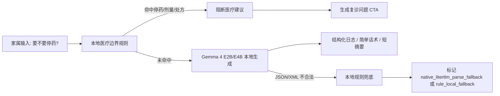

# Track C Edge Case Flash Design

## 5 秒演示脚本

场景：评委问 CareMind 是否会在本地离线状态下给出医疗建议。

1. 手机开启飞行模式，隐私模式 / Track C 离线模式已开启。
2. 在智能记录输入：`这个药要不要停？剂量是不是该减一点？`
3. CareMind 本地规则先于模型触发 `medication` guardrail。
4. 页面显示：`请不要自行停药或调整剂量。CareMind 只把它整理成复诊问题，不给用药建议。`
5. 结果页出现 `加入复诊问题清单` 动作，问题写法为：`是否需要调整当前用药或剂量？请医生结合病情判断。`

一句话讲法：

> CareMind 不回答“能不能停药”，而是离线拦截：请不要自行调整；我会把它整理成复诊问题。

## 设计原则

CareMind 的本地安全边界采用 “规则优先 + 本地模型 + 可编辑草稿” 的顺序。



这个链路不依赖云端，不要求联网，也不把模型兜底结果伪装成医学判断。

## 本地拦截范围

| 输入类型 | 本地处理 | 输出边界 |
| --- | --- | --- |
| `要不要停药？`、`剂量是不是该减？` | `medication` guardrail | 不给用药建议，转成复诊问题 |
| `是不是阿尔茨海默？` | `diagnosis` guardrail | 不诊断，保存观察给医生 |
| `要不要做 CT / MRI？` | `imaging_or_test` guardrail | 不建议检查项目，转成复诊问题 |
| `走失了 / 自伤 / 呼吸困难 / 胸痛` | `crisis` guardrail | 本地紧急提示，建议急救或就医 |

## 失败模式设计

| Failure mode | Demo 行为 | Provenance / 证据 |
| --- | --- | --- |
| 模型没下载 | 显示模型未就绪，允许手动草稿 | `source=unavailable` |
| 模型加载失败 / OOM | 不崩溃，安全边界仍由本地规则运行 | `source=rule_local_fallback` |
| 生成超时 | 不调用云端，使用短规则兜底 | `source=rule_local_fallback` |
| JSON/XML 输出不合法 | 不把结果标成模型成功，使用规则兜底 | `source=native_litertlm_parse_fallback` |
| 飞行模式下复诊摘要太慢 | 不跑长上下文，只基于缓存结构化日志生成短摘要 | `task=follow_up_summary` |
| 危机表达 | 本地规则先拦截 | `type=crisis` |
| 医疗越界 | 本地规则先拦截，转复诊问题 | `type=medication/diagnosis/imaging_or_test` |

## 评委可验证证据

离线验证报告新增步骤：

```text
[passed] 停药/剂量问题本地拦截:
triggered=true; type=medication; cta=create_doctor_question
source=rule_local_fallback
nativeGenerateAttempted=false
nativeGenerateReturned=false
```

如果模型已加载并参与普通任务，智能记录与简单话术仍应显示：

```text
source=native_litertlm_success
nativeGenerateAttempted=true
nativeGenerateReturned=true
rawOutputHash=<hash>
```

这样可以同时证明两点：

- 普通 demo 任务确实跑了本地 Gemma。
- 医疗越界和危机边界不依赖模型“猜对”，即使模型失败也能离线拦截。

## 实现位置

- `frontend/lib/inference/local/guardrail-local.ts`
  - 用药、诊断、检查、危机的本地规则。
  - 本地规则优先于模型输出。
  - CTA 支持 `create_doctor_question` / `open_emergency_support`。
- `frontend/lib/inference/local/care-workflow-local.ts`
  - 智能记录工作流内同样执行本地医疗边界规则。
  - 避免模型漏判时继续展示普通推理结果。
- `frontend/components/log/SmartLogScreen.tsx`
  - 医疗边界提示改为更适合演示的明确话术。
- `frontend/lib/inference/offline-verification.ts`
  - 离线验证增加“停药/剂量问题本地拦截”步骤。

## PPT 补充文案

可以放在技术亮点或安全边界页：

> Edge AI 不只是在手机上生成文本。CareMind 把“停药、剂量、诊断、检查、危机”这类高风险输入放在本地规则第一层处理。即使模型未加载、输出不合法或飞行模式下超时，App 也不会给出医疗建议，而是把问题转成可编辑的复诊问题清单。
