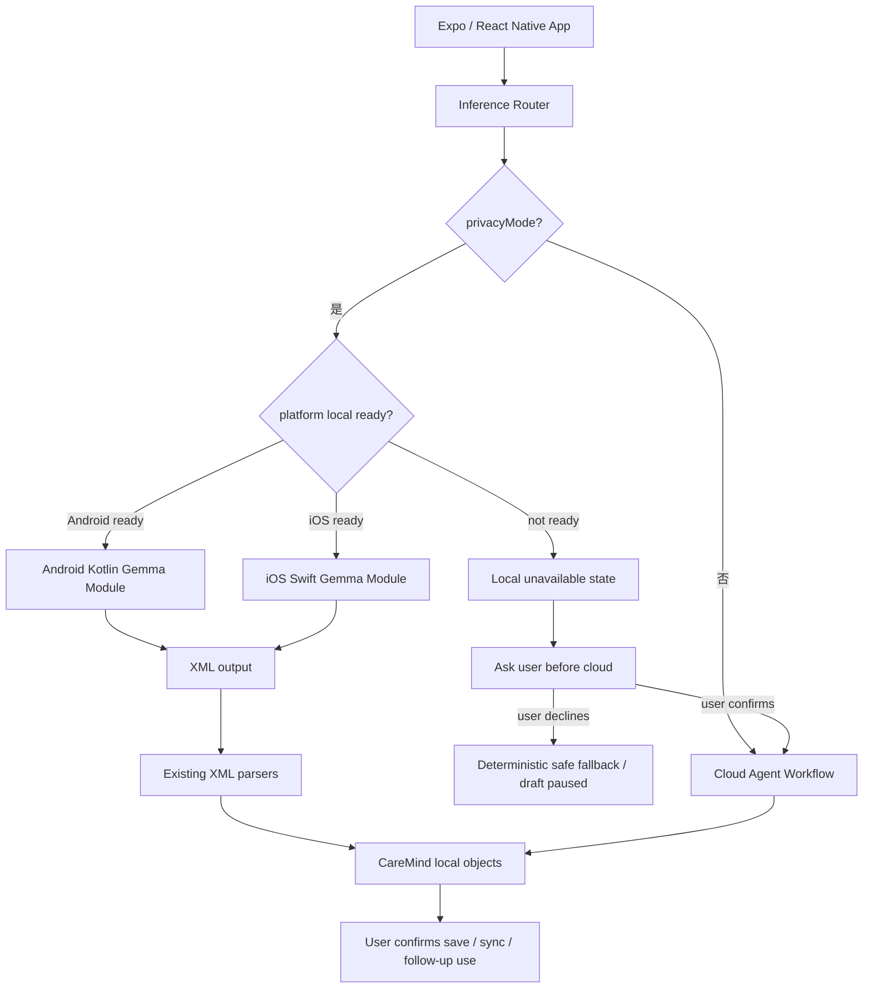

# CareMind iPhone 端侧功能设计

> 状态：设计方案 / 下一阶段实现指南。
> 日期：2026-06-08。
> 当前事实：iPhone 端已经支持完整 App 与云端 Agent 工作流；Android 端侧 Gemma LiteRT 已可演示。iPhone 本地大模型推理尚未实现，不能作为当前离线能力声明。

## 1. 目标

CareMind 的 iPhone 端侧能力要解决的不是“多一个平台 Demo”，而是让 iPhone 照护者在记录敏感家庭照护细节时，可以先在本机完成初步理解。

目标闭环：

```text
照护者在 iPhone 输入或录音
-> 语音先转成可编辑文本
-> 隐私模式判断是否可走 iOS 本地模型
-> 本地模型输出结构化照护整理
-> 复用现有 parser / fallback / guardrail
-> 家属确认后保存、进入复诊摘要或同步
```

P0 只做文本端侧理解。语音端侧转写放到 P2，因为当前产品已经可以通过系统语音或云端转写得到可编辑文本，端侧 LLM 的首要价值是处理敏感文本。

## 2. 非目标

- 不把 iPhone 本地推理描述成已完成能力。
- 不默认把 Android `.litertlm` 文件直接复用到 iOS。
- 不在隐私模式下本地失败后静默上传云端。
- 不做诊断、处方、检查决策或急救替代。
- 不在 P0 做全量云端 Agent 的本地复刻；本地只负责结构化、风险边界、沟通话术和摘要草稿。

## 3. 当前可复用资产

| 层 | 现有文件 | 复用方式 |
|---|---|---|
| 入口路由 | `frontend/lib/inference/inference-router.ts` | 增加 iOS local 分支和显式云端确认策略 |
| 隐私偏好 | `frontend/lib/inference/privacy-mode.ts` | 保持同一 toggle 与 selected model 存储 |
| 本地任务 | `frontend/lib/inference/local/care-workflow-local.ts` | 继续用同一 prompt、normalizer、fallback |
| 本地 guardrail | `frontend/lib/inference/local/guardrail-local.ts` | 本地和云端都执行医疗边界检查 |
| 复诊摘要 | `frontend/lib/inference/local/followup-local.ts` | P1 复用本地摘要草稿能力 |
| 输出格式 | `frontend/lib/inference/local/prompts-xml.ts`, `xml-parsers.ts` | iOS 也输出 XML，减少小模型 JSON 失败 |
| 模型目录 | `frontend/lib/inference/local/model-catalog.ts` | 扩展为 platform-aware catalog |
| Android native API | `frontend/android/app/src/main/java/com/caremind/app/gemma` | iOS API 尽量保持同名同义，降低 JS 改动 |
| 设置页 | `frontend/components/settings/PrivacyModeCard.tsx` | 展示 iPhone 本地模型状态、下载和删除 |

## 4. 推荐架构



设计要点：

- React Native 页面不直接知道 Android/iOS/云端差异。
- `Gemma` JS facade 负责选择平台 native module。
- iOS Swift 层只暴露模型生命周期和生成能力，不包含业务照护逻辑。
- 业务结构化、fallback、guardrail 和 telemetry 继续放在 TS 层，保证 Android/iOS 行为一致。

## 5. 运行时选择

截至 2026-06-08，官方资料给出的约束是：

- LiteRT 支持 iOS Swift / Objective-C 集成，并可通过 Core ML、Metal 等 delegate 提升性能。
- LiteRT GenAI 栈包含 LiteRT-LM，用来处理 LLM 的 session、KV cache、prompt cache 和 stateful inference。
- MediaPipe LLM Inference iOS 可以作为验证路线，但它的 iOS model matrix 不等同于 Android。当前文档里 Gemma-3 1B `.task` 标注为 Android/Web，不标注 iOS；Gemma 2B / Gemma-2 2B `.bin` 标注支持 iOS。

因此推荐：

| 阶段 | 运行时 | 模型格式 | 说明 |
|---|---|---|---|
| P0 skeleton | 无真实运行时 / stub | sentinel | 先跑通 RN -> Swift -> TS fallback |
| P1 text demo | LiteRT / LiteRT-LM 优先 | iOS 明确支持的 Gemma-family artifact | 不复用 Android artifact 假设 |
| P1 backup | MediaPipe LLM Inference iOS | `.bin` 或转换后的 `.task` | 只作为兼容验证路线 |
| P2 optimize | LiteRT + Metal/Core ML where supported | 量化小模型 | 以稳定、内存、热量为先 |

模型命名建议避免写死“Android 默认模型”。iOS catalog 应该把 `runtime`、`format`、`platforms`、`checksum` 和 `min_device` 明确列出。

## 6. JS facade 设计

当前 `gemma-native.ts` 把本地推理限制为 Android：

```ts
export const GEMMA_NATIVE_AVAILABLE = Platform.OS === "android" && !!NativeCaremindGemma;
```

建议改成平台 adapter facade：

```ts
type NativeGemmaPlatform = "android" | "ios";
type NativeGemmaRuntime = "mediapipe-llm" | "litert" | "litert-lm" | "stub";
type NativeGemmaAccelerator = "cpu" | "gpu" | "metal" | "coreml" | "auto";

export interface NativeGemmaRuntimeInfo {
  platform: NativeGemmaPlatform;
  runtime: NativeGemmaRuntime;
  accelerator: NativeGemmaAccelerator;
  supportsAudio: boolean;
  loadedModelId?: string;
  memoryClassMb?: number;
}
```

P0 保持现有 Android 方法名，iOS 提供同名方法：

```ts
interface CaremindGemmaSpec {
  isModelReady(filename: string): Promise<boolean>;
  getModelPath(filename: string): Promise<string>;
  downloadModel(filename: string, url: string, checksum?: string): Promise<{
    path: string;
    filename: string;
    bytes: number;
  }>;
  cancelDownload(filename: string): Promise<void>;
  deleteModel(filename: string): Promise<void>;
  initEngine(filename: string, options: GemmaEngineOptions | null): Promise<void>;
  releaseEngine(): Promise<void>;
  getRuntimeInfo(): Promise<NativeGemmaRuntimeInfo>;
  generate(prompt: string, options: GemmaGenerateOptions): Promise<GemmaGenerateResult>;
  generateWithAudio(
    prompt: string,
    audioFilePath: string,
    options: GemmaGenerateOptions
  ): Promise<GemmaGenerateResult>;
  cancelGeneration(requestId: string): Promise<void>;
  setStubMode(enabled: boolean): Promise<void>;
}
```

`generateWithAudio` 在 iOS P0/P1 可以返回明确错误：`LOCAL_AUDIO_NOT_SUPPORTED`。这样保留接口兼容，但不承诺语音本地转写。

## 7. iOS Native Module

推荐路径：

```text
frontend/
├── modules/
│   └── caremind-ios-gemma/
│       ├── expo-module.config.json
│       ├── ios/
│       │   ├── CaremindIosGemmaModule.swift
│       │   ├── IosGemmaEngine.swift
│       │   ├── IosModelStore.swift
│       │   ├── IosModelDownloader.swift
│       │   └── IosRuntimeInfo.swift
│       └── src/
│           └── index.ts
└── lib/inference/local/gemma-native.ts
```

如果为了最快对齐现有 Android bridge，也可以先让 Swift 模块暴露为 `NativeModules.CaremindGemma`。中长期更建议用 Expo Modules API，因为当前项目是 Expo / React Native，并已启用 New Architecture。

Swift 层职责：

- 模型文件下载、取消、删除。
- 文件名安全校验，禁止路径穿越。
- checksum 校验。
- 写入 App 私有目录。
- 设置 `isExcludedFromBackup`，避免大模型进入 iCloud 备份。
- engine singleton，避免每次请求重复加载模型。
- 生成请求串行化，同一时间只跑一个大模型 session。
- requestId 级取消。
- App 进入后台时释放或暂停 engine。
- 返回明确错误码，不让 JS 只能拿到一段模糊异常。

Swift 层不负责：

- 解析照护业务字段。
- 判断医学边界。
- 保存 CareMind 状态。
- 决定是否上传云端。

## 8. 模型目录扩展

当前 catalog 以 Android model picker 为主。iOS 端侧需要扩展字段：

```ts
interface ModelCatalogEntry {
  id: string;
  filename: string;
  display_name: string;
  description: string;
  platforms: Array<"android" | "ios" | "web">;
  runtime: "mediapipe-llm" | "litert" | "litert-lm";
  format: "litertlm" | "task" | "bin" | "tflite";
  supports_audio: boolean;
  tier: "light" | "medium" | "full" | "unknown";
  size_bytes: number;
  checksum_sha256: string;
  min_ios?: string;
  min_device_memory_gb?: number;
  recommended?: boolean;
  download_path: string;
  modified_at: string;
}
```

前端过滤规则：

```text
visibleModels = catalog.models
  .filter(model => model.platforms.includes(Platform.OS))
  .filter(model => model.runtime is supported by native runtime)
```

选择规则：

- 默认选当前平台 `recommended == true` 的轻量模型。
- Android 的 high-risk model 黑名单不要直接套到 iOS，改成 per-platform risk flags。
- 如果用户已选模型不支持当前平台，自动迁移到平台推荐模型，并提示一次。
- catalog 拉取失败时，iOS 不应该 fallback 到 Android 内置模型。

## 9. 隐私路由状态机

隐私模式必须从“开关”升级为可解释状态：

| 状态 | 说明 | 行为 |
|---|---|---|
| `cloud_allowed` | 隐私模式关闭 | 直接走云端 |
| `local_ready` | 隐私模式开启且本地模型可用 | 走本地 |
| `local_missing_model` | 没下载或 checksum 失败 | 停住并提示下载 |
| `local_runtime_unsupported` | 当前设备或 runtime 不支持 | 停住并解释 |
| `local_generation_failed` | 加载、内存、超时、输出失败 | 本地 fallback 或提示重试 |
| `cloud_confirm_required` | 用户想改用云端 | 明确确认后才上传 |

建议修改 `inference-router.ts` 的策略：

```text
if !privacyMode:
    run cloud
else if localReady:
    run local
else:
    throw LocalUnavailableError(reason)
```

页面拿到 `LocalUnavailableError` 后展示：

```text
本机模型还没准备好。
你可以下载 iPhone 本地模型，或明确选择本次使用云端整理。
```

例外：

- 本地模型输出 XML 破损时，可以继续使用 deterministic fallback，因为原始文本没有离开设备。
- guardrail 本地模型失败时，可以继续用 regex guardrail。
- 语音隐私模式下不能自动上传音频；必须让用户关闭隐私模式或显式确认云端转写。

这点和当前 Android 文本路由的“本地失败后静默回退云端”不完全一致。iOS 设计建议把这个行为作为后续统一隐私修复项。

## 10. iOS 设置页体验

`PrivacyModeCard` 在 iOS 上从“平台不支持”改成三段式：

1. 云端 Agent 可用。
2. iPhone 本地模型：未安装 / 下载中 / 已就绪 / 不支持。
3. 隐私模式说明：本地失败不会自动上传云端。

状态文案建议：

| 状态 | 文案 |
|---|---|
| 未下载 | `下载 iPhone 本地模型后，可在飞行模式下整理文字记录。` |
| 下载中 | `正在下载模型。下载完成前不会自动上传隐私记录。` |
| 已就绪 | `本机模型已就绪。隐私模式下文字记录优先留在 iPhone。` |
| 不支持 | `当前 iPhone 暂不支持本地模型，可继续使用云端 Agent。` |
| 失败 | `本地模型加载失败。你可以重试、删除模型，或本次确认使用云端。` |

不要在设置页把 iOS 端侧写成“已完成”。在没有真实 runtime 前，只显示“预研 / 待启用”。

## 11. 本地输出契约

iOS 与 Android 使用同一套 XML 输出，避免多平台 drift：

```xml
<caremind>
  <structured_log>
    <sleep>
      <night_wakings>4</night_wakings>
      <note>夜里醒来多次。</note>
    </sleep>
    <nutrition>
      <meal_intake>few_bites</meal_intake>
      <note>晚饭只吃了几口。</note>
    </nutrition>
    <caregiver>
      <quote>妈妈也很累</quote>
      <stress_level>medium</stress_level>
    </caregiver>
  </structured_log>
  <attention_items>
    <item>
      <type>night_safety</type>
      <severity>medium</severity>
      <title>今晚留意夜间安全</title>
      <evidence>夜里醒了四次。</evidence>
    </item>
  </attention_items>
  <guardrail>
    <triggered>false</triggered>
    <type>none</type>
  </guardrail>
  <boundary>这不是诊断或用药建议。</boundary>
</caremind>
```

解析失败策略：

- 先重试一次，要求只输出 XML。
- 仍失败则用 deterministic builder。
- telemetry 只上报 task、modelId、耗时、字符数、错误类别，不上传原始 note。

## 12. 存储与隐私

模型文件建议位置：

```text
Application Support/CareMind/Models/{filename}
```

处理规则：

- 大模型是可重新下载资产，写入后设置 `isExcludedFromBackup = true`。
- 下载中使用临时扩展名，例如 `{filename}.partial`。
- 下载完成后先校验 size 和 SHA-256，再原子 rename。
- 删除模型时如果当前 engine 已加载，先 release。
- 崩溃恢复时清理过期 `.partial` 文件。
- 不把模型文件放入普通 Git，不随普通 App bundle 分发 P0 模型。

用户数据规则：

- 隐私模式本地推理时，不发起业务网络请求。
- 只有家属点击保存、同步、生成云端摘要或确认云端整理时，才可能进入云端路径。
- 复诊资料进入摘要前继续要求家属确认。

## 13. 错误码

iOS module 需要返回稳定错误码：

| 错误码 | 含义 | UI 行为 |
|---|---|---|
| `IOS_RUNTIME_UNAVAILABLE` | runtime 未编译或设备不支持 | 显示不支持 |
| `MODEL_NOT_FOUND` | 模型不存在 | 引导下载 |
| `MODEL_CHECKSUM_FAILED` | 校验失败 | 删除并重新下载 |
| `MODEL_LOAD_OOM` | 加载内存不足 | 推荐轻量模型 |
| `MODEL_LOAD_FAILED` | runtime 加载失败 | 重试 / 删除 |
| `GENERATION_TIMEOUT` | 生成超时 | 保留输入，允许重试 |
| `GENERATION_CANCELLED` | 用户取消 | 不写入错误日志 |
| `LOCAL_AUDIO_NOT_SUPPORTED` | P0/P1 不支持本地音频 | 提示手动输入或显式云端转写 |

## 14. 实现阶段

### Phase 0: 文档与策略对齐

- 更新 iOS 端侧设计。
- 标明当前能力与目标能力边界。
- 把“隐私模式不静默上传”写入验收标准。

验收：README、技术报告、设置页文案不夸大 iOS 本地推理。

### Phase 1: JS facade + iOS stub

- 新增 iOS native module skeleton。
- `gemma-native.ts` 能识别 iOS module。
- `getRuntimeInfo()` 返回 platform/runtime/stub 状态。
- `PrivacyModeCard` 在 iOS 显示“本地模型待启用 / stub”。

验收：iOS App 可构建启动；stub 模式可返回固定 XML，TS parser 能跑通。

### Phase 2: iOS model store

- 扩展 `/api/models` schema。
- iOS 只展示 `platforms.includes("ios")` 的模型。
- 实现下载、进度、取消、删除、checksum、exclude backup。

验收：真机可下载、删除模型；重启后状态正确；失败不闪退。

### Phase 3: iOS local text inference

- 接入 LiteRT / LiteRT-LM 或验证后的 MediaPipe LLM runtime。
- `initEngine()` 加载 iOS 兼容模型。
- `generate()` 返回 XML。
- 本地 care workflow、guardrail、followup 复用现有 TS 逻辑。

验收：飞行模式下输入一条照护记录，得到结构化日志、关注事项、边界说明。

### Phase 4: 隐私 QA

- 网络请求审计。
- 低内存、超时、取消、后台切换测试。
- 医疗边界回归测试。
- iPhone 设备矩阵测试。

验收：隐私模式下本地推理没有业务网络请求；低内存不闪退；输出不越界。

### Phase 5: 语音增强

- 保持“语音先转可编辑文本”的产品路径。
- 评估系统 speech offline 能力与本地多模态模型可用性。
- 若实现本地音频，必须单独标注 `supports_audio`，不能与文本模型混用。

验收：音频路径不破坏隐私语义；无本地音频时不自动上传。

## 15. 验收标准

| 编号 | 验收项 | 标准 |
|---|---|---|
| IOS-01 | iOS 构建 | EAS / Xcode 真机包可安装启动 |
| IOS-02 | 模型目录 | iOS 只显示 iOS 兼容模型 |
| IOS-03 | 模型管理 | 下载、进度、取消、删除、checksum 可用 |
| IOS-04 | 本地文本推理 | 飞行模式下可返回结构化照护整理 |
| IOS-05 | 输出结构 | 睡眠、饮食、用药、安全、行为、照护者字段可解析 |
| IOS-06 | 隐私路由 | 隐私模式下本地不可用时不静默上传 |
| IOS-07 | 安全边界 | 不诊断、不处方、不判断检查、不替代急救 |
| IOS-08 | 失败处理 | OOM、缺模型、超时、输出破损不闪退 |
| IOS-09 | 用户确认 | 云端整理、资料入摘要、同步前需要确认 |
| IOS-10 | telemetry | 不上传原始照护文本或音频 |

## 16. 主要风险

| 风险 | 影响 | 缓解 |
|---|---|---|
| iOS runtime 与模型格式不匹配 | 无法本地生成 | P0 先验证官方 iOS 支持 artifact，不复用 Android 假设 |
| 中端 iPhone 内存不足 | 加载失败或系统杀进程 | 默认轻量模型、限制 token、串行生成、明确 OOM 错误 |
| 隐私模式语义混乱 | 用户以为没有上传但实际上传 | 本地不可用时抛错，云端必须显式确认 |
| 模型下载太大 | 首次体验差 | 后台下载提示、断点续传、轻量默认模型 |
| 小模型输出不稳定 | 结构化失败 | XML contract、一次重试、deterministic fallback |
| App Store / 隐私合规 | 审核风险 | 不捆绑超大模型，隐私说明写清数据流 |

## 17. 参考资料

- Google AI Edge LiteRT iOS quickstart: <https://developers.google.com/edge/litert/ios/quickstart>
- Google AI Edge LiteRT overview: <https://developers.google.com/edge/litert/overview>
- Google AI Edge LiteRT GenAI overview: <https://developers.google.com/edge/litert/genai/overview>
- MediaPipe LLM Inference iOS guide: <https://developers.google.com/edge/mediapipe/solutions/genai/llm_inference/ios>
- Expo Modules API overview: <https://docs.expo.dev/modules/overview/>
- Apple `isExcludedFromBackup`: <https://developer.apple.com/documentation/foundation/urlresourcevalues/isexcludedfrombackup>
