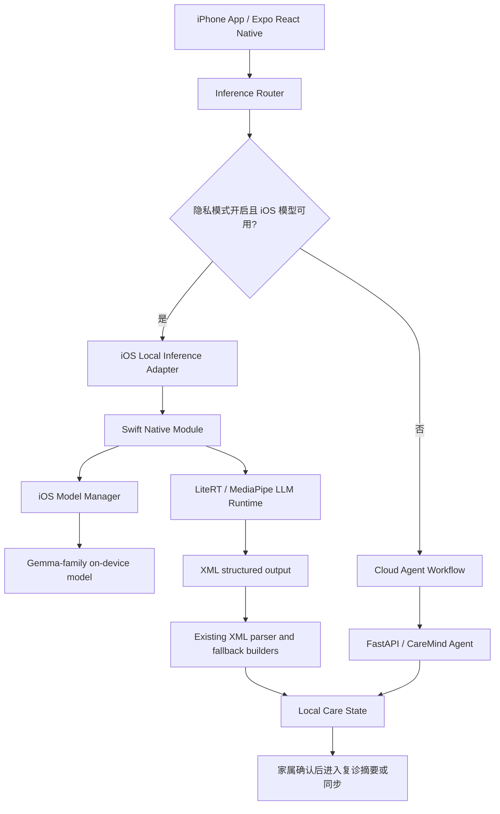

# CareMind iPhone 端侧架构补充

> 状态：架构补充 / 下一阶段实现方案。当前 iPhone 端已经支持完整 App 与云端 Agent 工作流；真正的 iOS 本地大模型推理需要新增 Swift Native Module 后才能作为端侧演示能力声明。

## 为什么补 iPhone 端侧

CareMind 的目标用户是家庭照护者。许多家属使用 iPhone 记录深夜照护细节，例如夜间起床、拒药、怀疑东西被偷、家庭压力和照护者崩溃时刻。这些记录非常私密，不应默认全部上传云端。

iPhone 端侧架构的目标是：在条件允许时，把敏感照护文本优先留在用户设备上完成初步理解，再由家属决定是否进入复诊材料或同步。

## 当前版本与目标版本

| 平台 / 模式 | 当前状态 | 目标状态 |
|---|---|---|
| iPhone 云端 Agent | 已支持 | 继续保留，负责完整 Agent 工作流 |
| iPhone 端侧文本理解 | 架构已设计 | 接入 Swift Native Module 后启用 |
| Android 端侧隐私模式 | 已可演示 | 继续作为 C 赛道硬件演示主路径 |
| 语音转文字 | 系统语音 / 上传转写 | 先转成可编辑文本，再交给端侧或云端理解 |

不要混淆：当前已完成的是 iPhone App 云端版与 Android 真机端侧演示；iPhone 本地大模型推理是后续落地路线。

## 推荐架构



## Native Module 设计

推荐新增独立 iOS 推理模块：

```text
frontend/
├── modules/caremind-ios-gemma/
│   ├── ios/
│   │   ├── CareMindGemmaModule.swift
│   │   ├── IosGemmaEngine.swift
│   │   └── IosModelStore.swift
│   └── src/index.ts
└── lib/inference/local/
    ├── gemma-native.ts
    ├── care-workflow-local.ts
    ├── guardrail-local.ts
    └── followup-local.ts
```

对外最小 API：

```ts
type IosGemmaModule = {
  isAvailable(): Promise<boolean>;
  getRuntimeInfo(): Promise<{
    platform: "ios";
    runtime: "litert" | "mediapipe-llm";
    accelerator: "cpu" | "metal" | "coreml";
    loadedModelId?: string;
  }>;
  loadModel(modelPath: string): Promise<void>;
  unloadModel(): Promise<void>;
  generate(prompt: string, options: {
    maxTokens: number;
    temperature: number;
    stop?: string[];
  }): Promise<string>;
};
```

## 模型策略

| 阶段 | 模型选择 | 原因 |
|---|---|---|
| P0 验证 | 官方 iOS 示例明确支持的 Gemma-family 小模型格式 | 先验证 Swift 调用、加载和生成 |
| P1 Demo | 低参数量量化模型 | 保证中端 iPhone 不闪退，优先稳定 |
| P2 增强 | Gemma 4 E2B / E4B iOS 候选 | 仅在 iOS runtime 与真机内存测试通过后开放 |

模型文件不随普通 Git 提交，应通过 Cloud Storage、Release asset 或 Git LFS 管理。下载后写入 App 私有目录，并排除 iCloud 备份。

## 隐私路由规则

```text
if privacyMode && platform == android && androidGemmaReady:
    run Android local Gemma
else if privacyMode && platform == ios && iosGemmaReady:
    run iOS local Gemma
else if userAllowedCloud:
    run cloud Agent workflow
else:
    run deterministic safe fallback
```

关键要求：

- 隐私模式开启时，如果本地模型不可用，不能静默上传云端。
- 需要明确提示用户：“本机模型未准备好，是否改用云端整理？”
- 医疗边界检查必须在本地和云端两侧都执行。
- 本地模型输出只作为照护观察整理，不作为医学判断。

## 验收标准

| 验收项 | 标准 |
|---|---|
| iOS 构建 | EAS / Xcode 真机包可安装启动 |
| 模型管理 | 可查看模型、下载模型、校验大小和 checksum、删除模型 |
| 本地推理 | 开启飞行模式后，输入照护记录仍能返回结构化照护整理 |
| 输出结构 | 睡眠、饮食、用药、情绪行为、安全、照护者状态字段可解析 |
| 安全边界 | 不出现诊断、处方、检查决策或夸大疗效 |
| 失败处理 | 低内存、模型缺失、超时和输出破损均不闪退 |
| 隐私证明 | 隐私模式本地推理时不发起业务网络请求 |
| 用户确认 | 复诊摘要和资料同步前需要家属确认 |

## 参考依据

- Google AI Edge LiteRT iOS quickstart: <https://ai.google.dev/edge/litert/ios/quickstart>
- Google AI Edge LiteRT overview: <https://ai.google.dev/edge/litert/overview>
- MediaPipe LLM Inference iOS guide: <https://developers.google.com/edge/mediapipe/solutions/genai/llm_inference/ios>
