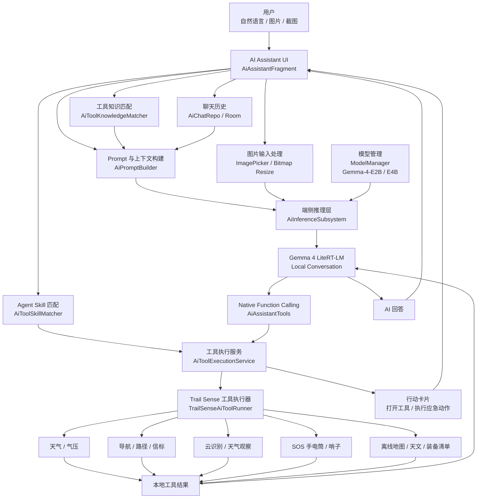
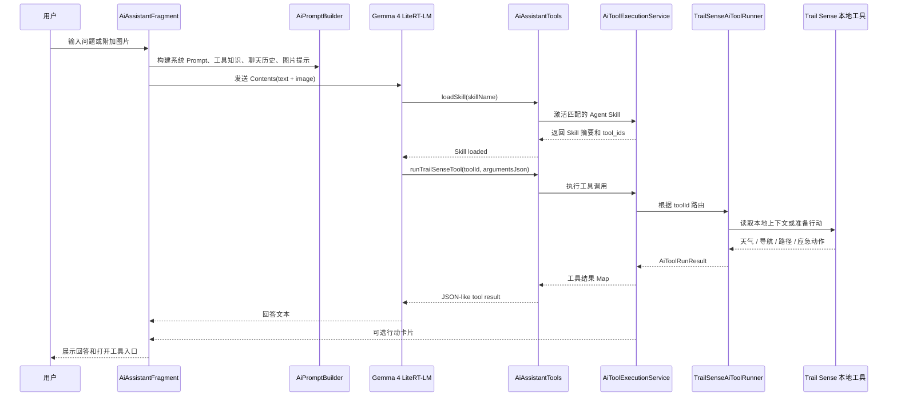
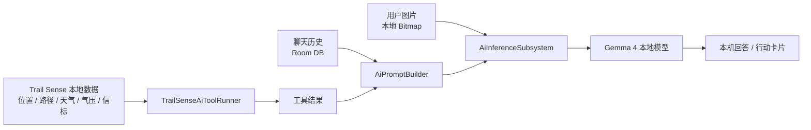

# Trail Sense AI Assistant 技术报告

## 1. 项目背景

Trail Sense 是一个面向徒步、露营、导航和生存场景的 Android 离线工具箱，原有能力覆盖天气、气压、导航、路径、信标、云识别、天文、生存指南、SOS 手电筒和哨子等户外工具。

本项目在原 Trail Sense App 基础上新增 AI Assistant，把 Gemma 4 端侧 LLM、多模态图片输入和 Agent Skill 工具调用接入到原有户外工具体系中。目标不是做通用聊天机器人，而是让用户可以用自然语言完成三类高频任务：

- 找工具：不知道该用哪个 Trail Sense 工具时，由 AI 推荐合适工具和使用顺序。
- 解释读数：把天气、气压、导航、云层、路径等本地上下文解释成可执行的户外判断。
- 执行动作：通过 Native Function Calling 生成 SOS 手电筒、哨子、打开工具等本机行动卡片。

## 2. 技术选型

### 2.1 LLM：Gemma 4

项目默认模型为 `Gemma-4-E2B-it`，并提供 `Gemma-4-E4B-it` 作为高性能设备可选模型。

选择 Gemma 4 的原因：

- 适合端侧部署：E2B 模型更适合移动设备本地加载和推理。
- 指令理解能力：适合自然语言问答、步骤解释、工具推荐和安全提醒。
- 多模态能力：可以结合文本和图片输入，支持云层、户外环境、App 截图等视觉上下文。
- 工具调用适配：可以通过 LiteRT-LM 的 ToolSet / ToolProvider 接入 Native Function Calling。
- 隐私友好：位置、路径、传感器、聊天和图片内容进入本机模型，不需要上传到云端 LLM API。

### 2.2 推理运行时：LiteRT-LM Android Runtime

项目使用 Google AI Edge LiteRT-LM Android Runtime：

```kotlin
implementation(libs.litertlm)
```

核心推理封装位于：

```text
app/src/main/java/com/kylecorry/trail_sense/tools/ai_assistant/infrastructure/AiInferenceSubsystem.kt
```

该模块负责：

- 根据本地模型路径初始化 LiteRT-LM `Engine`。
- 优先使用 GPU backend 和 vision GPU backend。
- GPU 初始化失败时自动回退 CPU backend。
- 创建带 system instruction 和 tools 的 `Conversation`。
- 将文本和图片输入转换为 LiteRT-LM `Content`。
- 设置采样参数：`topK = 64`、`topP = 0.95`、`temperature = 1.0`。
- 控制推理 token 上限和图片压缩尺寸。

## 3. 总体架构



架构分为六层：

- 交互层：`AiAssistantFragment` 提供聊天、图片附件、历史记录、建议问题和行动卡片。
- Prompt 层：`AiPromptBuilder` 将系统规则、聊天历史、工具知识、图片提示和本地上下文组合为模型输入。
- Agent Skill 层：`ai_tool_skills.md` 和 `AiToolSkillMatcher` 负责把用户目标映射为可执行工作流。
- 工具知识层：`ai_tool_knowledge.md` 和 `AiToolKnowledgeMatcher` 负责把 Trail Sense 工具说明、入口、读数含义注入上下文。
- 推理层：`AiInferenceSubsystem` 负责 Gemma 4 LiteRT-LM Engine、Conversation、图片输入和消息生成。
- 本地工具层：`AiAssistantTools`、`AiToolExecutionService`、`TrailSenseAiToolRunner` 负责 Native Function Calling 和 Trail Sense 本地能力访问。

## 4. 核心模块

| 模块 | 文件 | 作用 |
|---|---|---|
| AI 助手界面 | `AiAssistantFragment.kt` | 聊天 UI、图片附件、历史记录、模型初始化、行动卡片渲染 |
| 推理封装 | `AiInferenceSubsystem.kt` | LiteRT-LM Engine 初始化、Conversation 创建、文本和图片消息发送 |
| 模型管理 | `ModelManager.kt` | Gemma 4 模型列表、选择、下载、断点续传、本地路径和删除 |
| Prompt 构建 | `AiPromptBuilder.kt` | 系统安全规则、用户问题、工具知识、工具结果、图片上下文拼接 |
| 工具注册 | `AiAssistantTools.kt` | 向 LiteRT-LM 暴露 `loadSkill` 和 `runTrailSenseTool` |
| 工具执行 | `AiToolExecutionService.kt` | Skill 激活、工具选择、工具运行、结果格式化 |
| Trail Sense 执行器 | `TrailSenseAiToolRunner.kt` | 调用天气、导航、路径、信标、云识别、SOS 等本地工具能力 |
| 工具知识库 | `ai_tool_knowledge.md` | Trail Sense 工具入口、用途、读数解释和注意事项 |
| Skill 知识库 | `ai_tool_skills.md` | 面向目标的 Agent Skill 工作流定义 |

## 5. 模型管理与本地部署

模型管理由 `ModelManager` 完成。模型文件存放在 App 私有目录：

```text
filesDir/ai_models/
```

内置模型配置：

| 模型 | 文件名 | 用途 |
|---|---|---|
| `Gemma-4-E2B-it` | `gemma-4-E2B-it.litertlm` | 默认端侧 LLM，平衡速度和能力 |
| `Gemma-4-E4B-it` | `gemma-4-E4B-it.litertlm` | 高性能设备可选模型 |

下载流程支持断点续传：

- 下载时先写入 `*.tmp` 临时文件。
- 如果临时文件已存在，请求头加入 `Range` 继续下载。
- 下载完成后将临时文件重命名为正式 `.litertlm` 文件。
- 选择的模型 ID 存储在 `PreferencesSubsystem` 中。

推理初始化流程：

```text
用户进入 AI Assistant
  -> 检查 selectedModel 是否已下载
  -> 获取本地模型路径
  -> 使用 GPU backend 初始化 Engine
  -> 如果 GPU 初始化失败，使用 CPU backend 初始化 Engine
  -> 创建带 system prompt 和 ToolProvider 的 Conversation
```

## 6. Prompt、知识库与 Agent Skill

### 6.1 System Prompt

`AiPromptBuilder.buildSystemPrompt()` 负责生成系统指令，核心约束包括：

- 使用用户语言回答。
- 户外安全信息优先。
- 不伪造传感器读数。
- Trail Sense 工具问题优先使用工具知识库。
- 有工具结果时基于工具结果进行判断。
- 安全关键场景使用“不确定性”表达，不保证绝对安全。
- 多工具任务按工作流回答：主工具、辅助工具、使用顺序、读数解释和注意事项。
- 有图片时明确引用图片内容；如果是 Trail Sense 截图，需要读取可见标签、数字、单位和面板。

### 6.2 工具知识库

`ai_tool_knowledge.md` 将 Trail Sense 工具转化为 LLM 可理解的结构化知识，覆盖：

- 工具能解决什么问题。
- 工具在 App 中的位置。
- 如何使用工具。
- 关键读数或界面值如何解释。
- 和哪些工具组合使用。
- 高风险场景下需要提醒的注意事项。

`AiToolKnowledgeMatcher` 会根据用户问题进行中英文混合匹配，支持：

- 短语匹配。
- 英文 token 匹配。
- 中文 CJK 双字窗口匹配。
- 对当前偏好工具进行轻量 boost。

### 6.3 Agent Skill

`ai_tool_skills.md` 把 Trail Sense 工具封装成面向目标的 Agent Skill。相比单个工具说明，Skill 表达的是“完成一个户外任务的工作流”。

典型 Skill 类型：

- 迷路处理：导航、路径、信标、离线地图组合。
- 天气风险判断：天气、气压、云识别、雷电距离组合。
- 天黑前返程：日落、导航、路径、转身提醒组合。
- 求救信号：SOS 手电筒、哨子、信标组合。
- 户外读数解释：将工具读数转化为行动建议。

`AiAssistantTools.loadSkill()` 将 Skill 暴露给 Gemma 4，模型可以先加载工作流，再调用具体 Trail Sense 工具获取本地上下文。

## 7. Native Function Calling 设计

项目通过 LiteRT-LM ToolSet 向 Gemma 4 注册两个核心工具：

```text
loadSkill(skillName)
runTrailSenseTool(toolId, argumentsJson)
```

### 7.1 工具调用时序



### 7.2 已接入的本地能力

`TrailSenseAiToolRunner` 根据 Trail Sense 工具 ID 路由本地能力，覆盖：

- `Tools.WEATHER`：天气和气压上下文。
- `Tools.CLOUDS`：云层观察和天气迹象。
- `Tools.NAVIGATION`：导航方向和位置相关上下文。
- `Tools.PATHS`：路径、返程和轨迹相关上下文。
- `Tools.BEACONS`：信标和定位标记。
- `Tools.OFFLINE_MAPS`：离线地图能力入口。
- `Tools.LIGHTNING_STRIKE_DISTANCE`：雷电距离判断。
- `Tools.TURN_BACK`：返程提醒工作流。
- `Tools.ASTRONOMY`：天文和日落相关信息。
- `Tools.PACKING_LISTS`：装备清单。
- `Tools.FLASHLIGHT`：SOS 手电筒行动卡片。
- `Tools.WHISTLE`：哨子求救行动卡片。

工具调用返回 `AiToolRunResult`，包含：

- `toolId`
- `toolName`
- `status`
- `summary`
- `sensorData`
- `error`
- 可选的打开工具动作

这样 Gemma 4 的回答不是凭空生成，而是基于 Trail Sense 本地工具返回的上下文生成。

## 8. 多模态图片输入

Gemma 4 Gallery App 展示的多模态能力在本项目中落到 Trail Sense 的户外场景：

- 用户可以在 AI Assistant 聊天中附加图片。
- `AiAssistantFragment` 通过系统图片选择器读取图片。
- 图片在 UI 层先按最大边缩放，避免加载超大 Bitmap。
- `AiInferenceSubsystem.sendMessage()` 再将图片缩放到模型输入尺寸并压缩为 JPEG bytes。
- 图片和文本一起作为 LiteRT-LM `Contents` 发送给 Conversation。

图片输入链路：

```text
ImagePicker
  -> Uri
  -> Bitmap decode
  -> UI scale
  -> retainedAttachedImage
  -> AiPromptBuilder adds [Attached image] instruction
  -> AiInferenceSubsystem converts Bitmap to Content.ImageBytes
  -> Gemma 4 multimodal inference
```

支持的典型场景：

- Trail Sense 截图解释：识别截图中的工具界面、标签、数字、单位和面板含义。
- 云层图片解释：辅助判断云型和潜在天气变化。
- 户外环境观察：根据图片给出可行动的观察建议。
- 植物或动物图片：尝试识别并提示安全风险。

## 9. 本地数据与隐私设计

Trail Sense 原有定位、路径、天气、气压和传感器数据主要保存在本机。本项目延续这个设计：

- AI 推理在 Android 设备本地运行。
- 聊天历史保存在本地 Room 数据库。
- 位置、路径、传感器读数、图片和聊天内容不会发送到云端 LLM API。
- Native Function Calling 只读取本机 App 数据或准备本机动作。
- 模型下载只获取 `.litertlm` 模型文件，不上传用户上下文。

数据流如下：



## 10. 安全策略

户外场景涉及天气、导航、救援、医疗和生命安全。本项目在 Prompt、工具知识和 UI 层加入安全策略：

- 不把 AI 回答包装成绝对结论。
- 不伪造传感器读数或不存在的工具结果。
- 高风险场景优先建议用户使用真实装备、官方信息和专业救援渠道。
- 对天气、导航、云层、失温、雷暴、迷路等问题使用“风险提示 + 可执行步骤 + 注意事项”的结构。
- SOS 手电筒、哨子等应急能力以行动卡片方式呈现，减少用户在紧张场景中的操作成本。

## 11. 验证结果

已执行本地验证：

```bash
./gradlew :app:testDebugUnitTest
./gradlew :app:assembleDebug
./gradlew :app:assembleRelease
```

验证覆盖：

- AI Prompt 构建。
- 工具知识解析和匹配。
- Agent Skill 解析和匹配。
- 模型管理和下载状态。
- 工具执行服务。
- 天气上下文 provider。
- Debug APK 构建。
- Release APK 构建。

提交材料中包含：

- Demo 视频：https://www.youtube.com/watch?v=EkK9DF7OfXg
- Demo 视频备用下载：https://raw.githubusercontent.com/jiantao88/Trail-Sense/feature/ai-assistant/submissions/2026/C/Trail-Sense-AI-Assistant/demo/trail-sense-ai-assistant-demo.mp4
- APK 下载：https://raw.githubusercontent.com/jiantao88/Trail-Sense/feature/ai-assistant/submissions/2026/C/Trail-Sense-AI-Assistant/demo/trail-sense-ai-assistant-release-unsigned.apk
