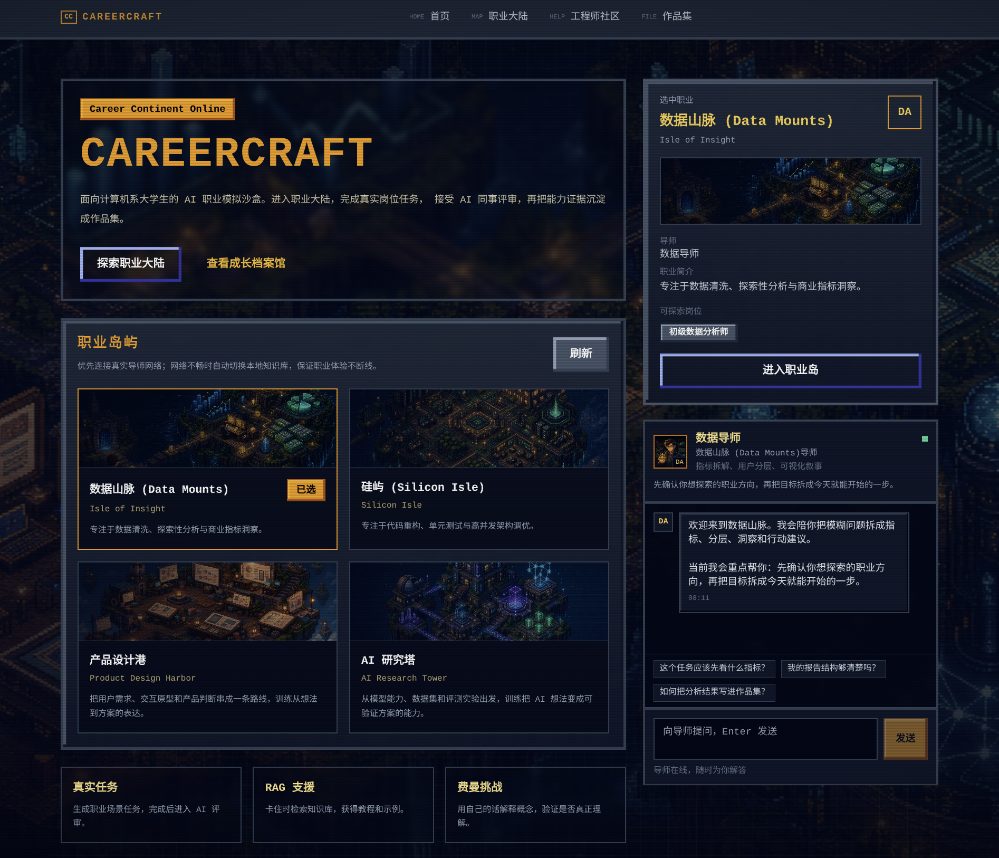
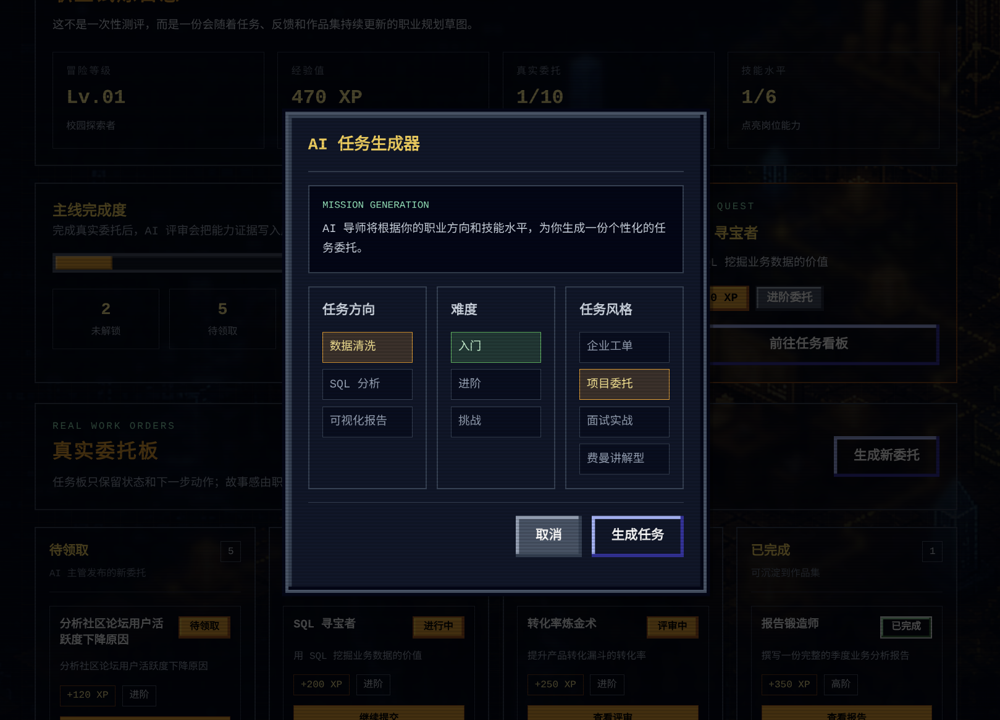
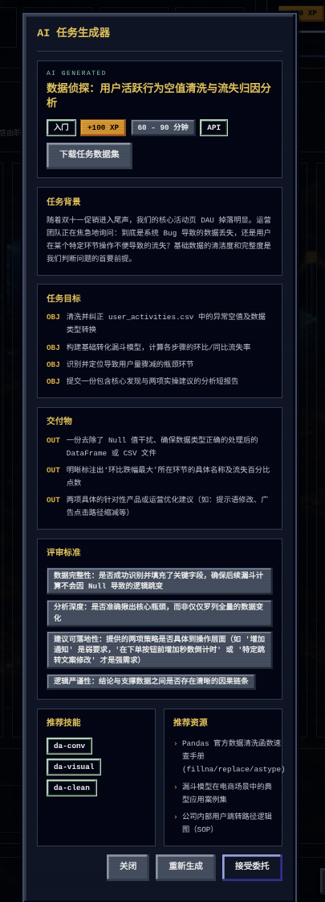
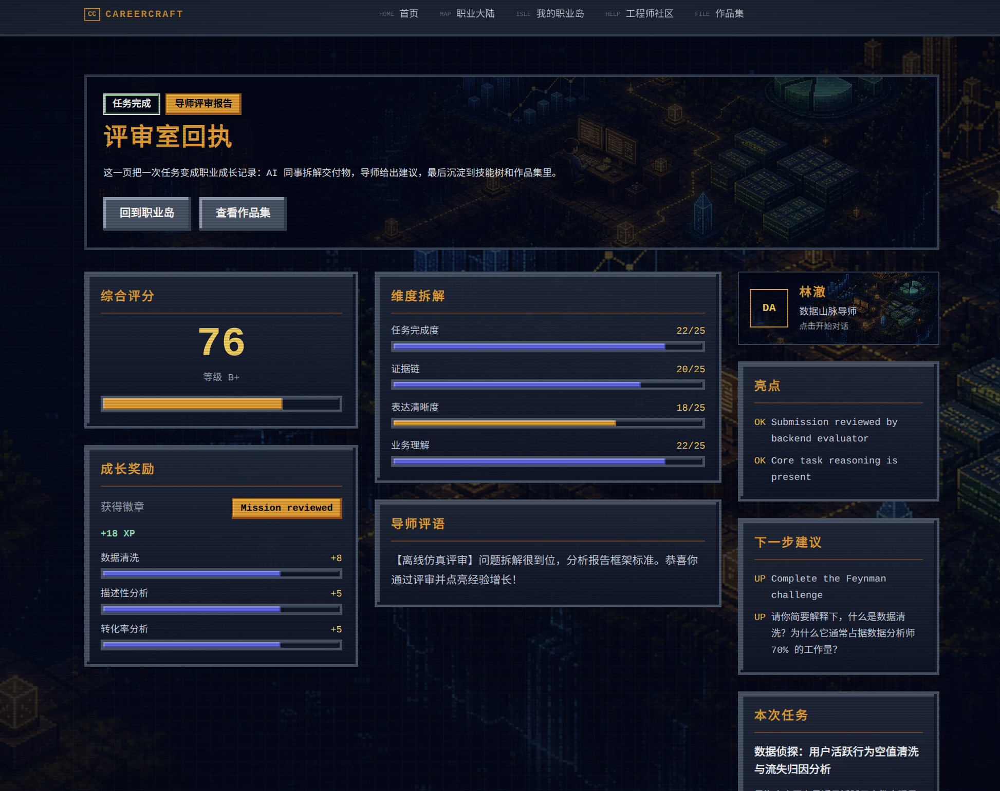

# 🧠 CareerCraft - AI 驱动的职业模拟沙盒

赛道：D - Social Good  
核心模型：Gemma 4，本地推荐通过 Ollama / OpenAI-compatible API 调用 `gemma4:26b`。  
项目定位：面向学生、转行者和资源有限的职业探索人群，用 AI 生成真实工作任务、提供学习资源、评审作品并沉淀技能成长路径。

> 这不是一个题库，而是一个"职场模拟器"。
> 用户在游戏化任务中完成真实职业交付，接受 AI"主管 / 同事 / 客户"的结构化反馈，逐步点亮技能树。

[](LICENSE)
[](#快速开始)

## 🎬 演示材料

- 🎥 演示视频：[演示视频.mp4](演示视频.mp4)
- 🖼️ 前端截图：[ui/](ui/)
- 🛠️ 后端说明：[backend/README.md](backend/README.md)
- 📐 产品与系统规格：[docs/specification/](docs/specification/)

## ✨ 项目简介

CareerCraft 是一个职业学习与就业准备方向的 Social Good 项目。传统学习产品常把知识拆成课程或题库，但真实职场更看重问题拆解、资料检索、交付质量、沟通表达和复盘能力。CareerCraft 将这些能力包装成可玩的职业任务：

1. 🎯 用户选择职业方向，例如数据分析师或软件工程师。
2. 🧑‍💼 AI 主管生成贴近真实工作的任务背景、数据物料和交付要求。
3. 📚 用户可以检索内置 Markdown 知识库，获得 Pandas、Matplotlib、工程实践等学习支援。
4. 📝 用户提交报告或方案后，AI 同事从拆解、准确性、可行性等维度给出评分。
5. 🌱 系统把反馈结算为经验值和技能树进度，并触发费曼挑战检查真实理解。

## 🌍 为什么属于 Social Good

CareerCraft 希望降低职业探索与技能训练的门槛，尤其帮助缺少实习机会、导师资源或项目经验的学习者。

- 🌱 **更低成本的职业试错**：用户可以在安全环境中体验真实岗位任务，而不需要先获得实习或商业项目机会。
- ⚖️ **面向能力而非学历标签**：系统关注作品交付、思考过程和技能成长，帮助用户看到可改进的具体路径。
- 🔍 **可解释反馈**：AI 不只给分，还说明评分原因、下一步学习资源和可操作改进建议。
- 🧩 **本地优先与可离线演示**：默认支持 mock/fallback 模式，无 API Key 也能体验核心流程；配置 Gemma 4 后可切换真实 LLM。

## 🤖 Gemma 4 如何参与

CareerCraft 使用 Gemma 4 作为职业任务与评审的推理引擎，而不是简单聊天入口。

```text
用户职业目标
  -> 任务生成 Agent：生成任务背景、目标、交付物和评分标准
  -> 物料生成 Agent：生成 CSV / 文本等任务素材
  -> RAG 检索：从本地 Markdown 知识库召回学习资源
  -> 评审 Agent：基于任务、物料和用户提交内容输出结构化反馈
  -> 费曼挑战 Agent：追问关键概念，检查用户是否真正理解
  -> 技能树 / XP：沉淀成长记录
```

当前后端提供统一 `LLMClient` 抽象，可接入 Gemini、OpenAI-compatible、Anthropic 或 Ollama。Hackathon 本地演示推荐：

```text
LLM_PROVIDER=openai
LLM_BASE_URL=http://host.docker.internal:11434/v1
LLM_API_KEY=ollama
LLM_MODEL=gemma4:26b
MOCK_AGENT_OUTPUT=false
```

如果只想快速查看 UI 和业务闭环，可以保留默认 `MOCK_AGENT_OUTPUT=true`，系统会使用本地 fallback，不发起外部 LLM 请求。

## 🚀 核心特性

- **多角色 Agent**：LLM 扮演"主管 / 同事 / 客户"，动态出题并给出结构化评审。
- **真实任务物料**：任务生成时可产出可下载数据文件或业务材料，评审时可回读物料上下文。
- **游戏化成长**：完成任务积累经验值，点亮可视化技能树。
- **RAG 学习支援**：卡壳时一键检索内置 Markdown 知识库。
- **费曼挑战**：AI 随机追问，帮助用户确认是否真正理解关键概念。
- **LLM 审计日志**：开发模式下记录 LLM 请求/响应 JSONL，方便排查与复盘。

## 🎮 MVP 演示流程

1. 🏔️ 进入"数据山脉"，成为初级数据分析师。
2. 📌 主管 Agent 发布任务："分析社区论坛活跃度下降原因"。
3. 🔎 点击"寻找资源"，RAG 推荐 Pandas / Matplotlib 等教程。
4. 📄 下载任务物料并提交分析报告。
5. 🧑‍⚖️ 同事 Agent 从问题拆解、数据准确性、建议可行性等维度评分。
6. ⭐ 获得类似 `{"skill_data_cleaning": +10, "skill_communication": +8}` 的成长结算，并点亮技能节点。
7. 💡 触发费曼挑战，用自己的话解释关键方法。

## 🖼️ 界面预览

### 🏠 首页



### 🧭 AI 任务生成





### 🧾 AI 评审反馈



## 🏗️ 系统架构

```text
Next.js 前端
  -> FastAPI API
  -> Mission / Evaluation / Feynman Orchestrators
  -> Gemma 4 或本地 fallback
  -> SQLite 用户进度
  -> ChromaDB + Markdown 知识库
  -> 技能树 / 任务物料 / 评审反馈
```

主要技术栈：

| 模块 | 技术 |
|---|---|
| 前端 | Next.js 14, React, TypeScript, Tailwind CSS, Zustand |
| 后端 | FastAPI, SQLAlchemy, SQLite |
| RAG | ChromaDB + 本地 Markdown 知识库 |
| LLM 接入 | 统一 LLMClient，支持 Gemma 4 / Gemini / OpenAI-compatible / Anthropic / Ollama |
| 部署 | Docker Compose |

## 📁 仓库结构

```text
Careercraft/
├── backend/        # FastAPI + SQLite + ChromaDB，见 backend/README.md
├── frontend_new/   # Next.js 前端，Docker 默认构建此目录
├── docs/           # 产品规格、角色设定、技能树、知识库 Markdown
├── ui/             # README 截图素材
├── .env.example    # 根目录环境变量模板，供 docker-compose.yml 使用
└── docker-compose.yml
```

## 🚀 快速开始

### 🐳 方式一：推荐，用 Docker Compose 启动整套服务

1. 在仓库根目录复制环境变量模板：

```bash
cp .env.example .env
```

2. 根据需要编辑根目录 `.env`。

重要说明：

- `docker compose` 默认读取的是仓库根目录、与 `docker-compose.yml` 同级的 `.env`
- 不要把实际 Docker 启动配置放在 `backend/.env`
- 前端构建时会使用 `NEXT_PUBLIC_API_BASE_URL`，默认推荐：`http://localhost:8003`
- 如果在宿主机运行 Ollama，Docker 内访问宿主机通常使用 `http://host.docker.internal:11434/v1`

3. 在仓库根目录启动：

```bash
docker compose up --build
```

启动后访问：

- 前端：`http://localhost:8004`
- 后端 API：`http://localhost:8003`
- 后端 OpenAPI：`http://localhost:8003/docs`

### 💻 方式二：本地分别启动前后端

```bash
# 后端，详细说明见 backend/README.md
cd backend
python3 -m venv venv
source venv/bin/activate   # Windows: .\venv\Scripts\activate
pip install -r requirements.txt
python3 -m app.main        # http://127.0.0.1:8000/docs

# 前端
cd ../frontend_new
npm install
npm run dev
```

## ✅ 测试与验证

后端单元测试：

```bash
cd backend
python3 -m unittest discover -s tests
```

前端构建：

```bash
cd frontend_new
npm install
npm run build
```

真实 LLM 测试需要显式配置 `LLM_API_KEY` / `LLM_BASE_URL` / `LLM_MODEL`，并关闭 `MOCK_AGENT_OUTPUT`。

## 🔐 隐私与边界

- MVP 默认使用本地 SQLite 与本地 ChromaDB，不接入云端账号体系。
- 演示任务与知识库材料为模拟职业学习场景，不包含真实个人隐私。
- 系统提供学习建议和职业能力训练反馈，不承诺就业、升学或商业结果。
- AI 评审用于训练和复盘，不应作为正式招聘、薪酬、绩效或资质认证的唯一依据。
- 用户提交内容如包含隐私或商业机密，应在部署前增加数据脱敏、访问控制和日志留存策略。

## 📦 提交说明

项目提交路径：

```text
submissions/2026/track_D/Careercraft/
```

PR 标题建议：

```text
[赛道D] CareerCraft - AI 驱动的职业模拟沙盒
```

## 📜 License

MIT
