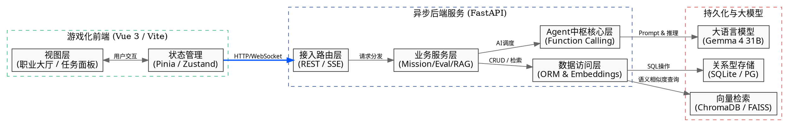
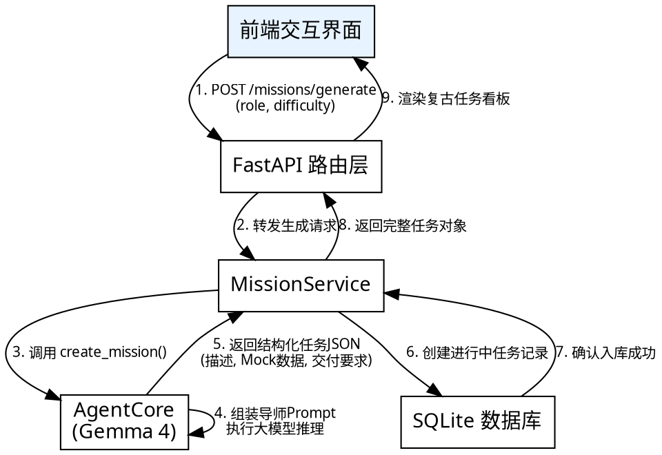
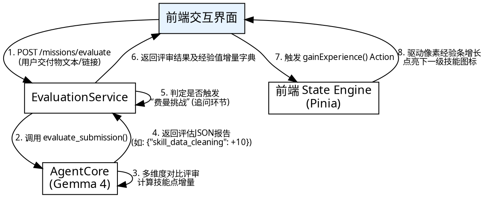

<!-- mdformat global-off -->
# 前后端系统框架详细设计

本文档详细规定了 CareerCraft (AI驱动的职业模拟沙盒 MVP) 的前后端系统架构分层、核心模块交互协议以及标准工程目录树。旨在为开发团队提供高清晰度、可落地的开发指南。

## 一、 系统整体拓扑图

本系统采用前后端分离架构，通过轻量级通信协议将2D像素风前端与高并发异步后端无缝串联，并由大模型与本地向量库共同驱动核心业务。



## 二、 前端架构分层设计

前端整体采用 **Vite + Vue 3 (组合式 API + TypeScript)** 构建，放弃传统重度组件库，通过 **Vanilla CSS / CSS Modules** 原生打造 2D 像素艺术风格，确保极简开销与强烈的沉浸感。

### 1. 视图与页面层 (Views)
- **`LobbyView` (职业大厅)**：负责呈现世界地图。通过限制色板与 CSS 滤镜实现岛屿的高亮与解锁状态展示。
- **`CareerHubView` (职业中枢)**：整合当前岛屿的核心面板，左右分栏展示AI导师形象、任务接取面板、资源书架与核心技能树。
- **`MissionInteractionView` (任务交互)**：高度定制的复古对话界面，支持动态多角色问候展示、交付物上传与即时打分反馈。

### 2. 像素组件库 (Components)
- **基础 UI 组件 (`PixelUI`)**：
  - `PixelButton`：利用原生 CSS 的 `box-shadow` 模拟完美的 1px 锯齿立体边框及按下凹陷状态。
  - `RetroDialog`：经典的 RPG 对话框风格，深色背景搭配点阵字体。
  - `PixelProgressBar`：用于展示技能经验值 (`exp_to_next`)，分块递增显示。
- **业务组件**：
  - `AgentAvatar`：根据传入的 `role_id` 动态加载并呈现对应角色的像素点阵动画头像。
  - `ChatBubble`：实现配合打字机音效的文字逐字渐现逻辑。
  - `SkillTreeRenderer`：利用 SVG 或绝对定位 CSS 动态绘制技能树节点与连接线（通过判断 `parent_skill_id` 的点亮状态变更连线颜色）。

### 3. 状态引擎层 (State Management)
基于 **Pinia** 实现单一可信数据源，避免复杂层级透传：
- `useUserStore`：管理用户基础属性、已解锁岛屿及当前累积总经验。
- `useSkillStore`：缓存 `skill_tree_definition.md` 对应数据，维护各个技能节点 (`skill_id`) 的当前等级与下一级所需经验。提供 `gainExperience(skills_dict)` Action 自动驱动连带解锁。
- `useMissionStore`：管理当前进行中的任务数据、Mock数据源以及阶段性的AI交流历史。

### 4. 通信适配器层 (Services)
封装强类型的 HTTP 客户端：
- **RESTful 客户端**：用于获取静态知识库、职业剧本与提交评估报告。
- **SSE / WebSocket 监听器**：用于监听 `act_as_role` 触发的多角色情境对话流，保证打字机效果零延迟。

## 三、 后端架构分层设计

后端采用 **FastAPI (Python 3.11+)**，利用其强大的异步特性与基于 Pydantic 的模型校验，与大模型结构化输出深度整合。

### 1. 接入路由层 (Routers)
定义清晰、RESTful 的 API 路由树：
- `GET /api/v1/careers`：获取职业列表及岛屿分布。
- `POST /api/v1/missions/generate`：根据传入的职业与难度动态创建任务。
- `POST /api/v1/missions/evaluate`：提交最终报告，返回结构化评分与经验值。
- `GET /api/v1/agent/chat`：Server-Sent Events (SSE) 接口，负责与不同 AI 角色流式对话。

### 2. 业务服务层 (Services)
- **`MissionService`**：统筹任务的发起、状态持久化及交付标准校验。
- **`EvaluationService`**：解析大模型输出的 JSON 评估报告，核算技能成长幅度，并按固定概率随机触发“费曼挑战”。
- **`RagService`**：加载对应职业的任务 Markdown 库，进行文本切割 (`Chunking`)、向量化计算，并在用户卡壳时提供精准的 Top-K 相似度片段检索。

### 3. Agent 中枢核心层 (AgentCore)
本层是对 Gemma 4 31B 模型的深度封装：
- **Prompt 组装引擎**：解析 `ai_roles_definition.md`，动态组装 System Prompt（注入 `personality_tags` 与 `responsibilities`）。
- **Function Calling 适配器**：强制模型输出严格的 JSON 格式，保障 `create_mission` 与 `evaluate_submission` 的结构化输出不会发生格式崩溃。

### 4. 数据访问层 (DAL & Repositories)
- **关系型持久化 (`SQLAlchemy` / `SQLModel`)**：
  - MVP阶段适配 SQLite，单文件轻量部署；提供到 PostgreSQL 的无缝迁移能力。
  - 设计实体模型：`User`, `SkillProgress`, `MissionRecord`。
- **向量检索抽象**：
  - 封装本地轻量级库 ChromaDB/FAISS，提供 `upsert_document` 和 `similarity_search` 标准接口。

## 四、 核心数据交互时序图

### 1. 任务动态生成时序



### 2. 提交评估与经验增长时序



## 五、 标准前后端工程目录树规划

为保障团队开发的高效解耦，规划如下 Monorepo / 独立双仓的标准工程目录树：

```text
careercraft_dev/
├── frontend/                           # 游戏化前端工程 (Vue 3 + Vite)
│   ├── public/
│   │   └── icons/                      # 基础像素图标库 (SVG)
│   ├── src/
│   │   ├── assets/
│   │   │   └── styles/                 # 全局 Vanilla CSS / 像素风基础样式
│   │   ├── components/
│   │   │   ├── common/                 # 像素 UI 库 (PixelButton, RetroDialog)
│   │   │   ├── agent/                  # AI 对话框与形象展示
│   │   │   └── skill/                  # 技能树可视化绘制组件
│   │   ├── views/                      # 核心视图 (Lobby, CareerHub, Mission)
│   │   ├── stores/                     # Pinia 状态机 (user, skill, mission)
│   │   ├── services/                   # HTTP 客户端与 SSE 监听适配器
│   │   ├── App.vue
│   │   └── main.ts
│   ├── package.json
│   └── vite.config.ts
│
├── backend/                            # 异步后端工程 (FastAPI)
│   ├── app/
│   │   ├── api/
│   │   │   └── v1/                     # 路由分发层 (careers, missions, agent)
│   │   ├── core/
│   │   │   ├── config.py               # 全局配置 (模型超参数、数据库路径)
│   │   │   └── agent.py                # AgentCore：统一封装 Gemma 4 调用
│   │   ├── models/                     # 持久层实体与 Pydantic 校验 Schema
│   │   ├── services/                   # 业务服务层 (mission, eval, rag)
│   │   ├── db/                         # 数据库连接与 ChromaDB 实例初始化
│   │   └── main.py                     # FastAPI 应用入口
│   ├── requirements.txt
│   └── pyproject.toml
│
└── docs/                               # 规范与开发知识库
    ├── specification/                  # 系统规格说明书
    └── knowledge_base/                 # 各职业 RAG 配套 Markdown 教程源文件
```
